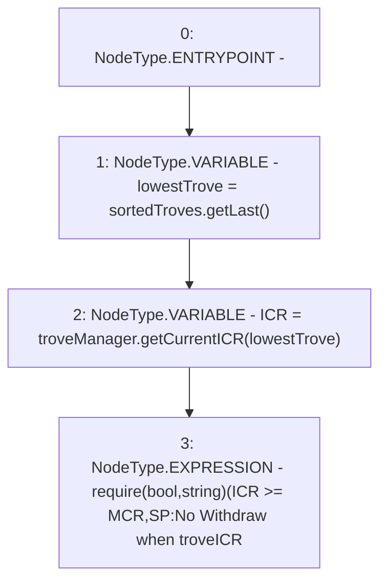

# Context: StabilityPoolTester._requireNoUnderCollateralizedTroves

**Contract:** `StabilityPoolTester` (Inherits: StabilityPool, IStabilityPool, ICollateralReceiver, CheckContract, Ownable, LiquityBase, YetiCustomBase, BaseMath, ILiquityBase)
**Signature:** `_requireNoUnderCollateralizedTroves()`
**Method Selector ID:** `Internal (No Method ID)`
**Visibility:** `internal`
**Environment-Free:** `Yes`
**Modifiers:** None

### State Variables Interaction
- **Reads:** MCR, sortedTroves, troveManager
- **Writes:** None

### Assertion Checks & Business Requirements
- require/assert: `require(bool,string)(ICR >= MCR,SP:No Withdraw when troveICR<MCR)`

### Environment & Verification Flags
- **Uses Foundry Cheatcodes:** No
- **Has Echidna Properties:** No

### Internal Calls Tree
- None

### External Calls / Value Transfers
- `ISortedTroves.TMP_895(address) = HIGH_LEVEL_CALL, dest:sortedTroves(ISortedTroves), function:getLast, arguments:[]  `
- `ITroveManager.TMP_896(uint256) = HIGH_LEVEL_CALL, dest:troveManager(ITroveManager), function:getCurrentICR, arguments:['lowestTrove']  `

### Control Flow Graph (CFG)


### Source Mapping
Declared in: `certora-ac-datasets/detasets/web3bugs/dataset/web3bugs/66/packages/contracts/contracts/StabilityPool.sol` on lines **1087** to **1091**

```solidity
    function _requireNoUnderCollateralizedTroves() internal view {
        address lowestTrove = sortedTroves.getLast();
        uint256 ICR = troveManager.getCurrentICR(lowestTrove);
        require(ICR >= MCR, "SP:No Withdraw when troveICR<MCR");
    }

```
