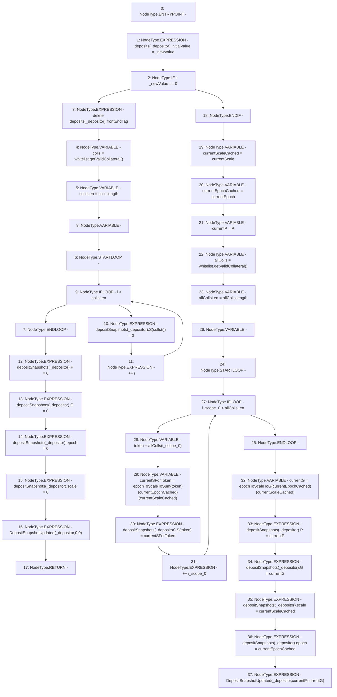

# Context: StabilityPoolTester._updateDepositAndSnapshots

**Contract:** `StabilityPoolTester` (Inherits: StabilityPool, IStabilityPool, ICollateralReceiver, CheckContract, Ownable, LiquityBase, YetiCustomBase, BaseMath, ILiquityBase)
**Signature:** `_updateDepositAndSnapshots(address,uint256)`
**Method Selector ID:** `Internal (No Method ID)`
**Visibility:** `internal`
**Environment-Free:** `Yes`
**Modifiers:** None

### State Variables Interaction
- **Reads:** P, currentEpoch, currentScale, depositSnapshots, deposits, epochToScaleToG, epochToScaleToSum, whitelist
- **Writes:** depositSnapshots, deposits

### Environment & Verification Flags
- **Uses Foundry Cheatcodes:** No
- **Has Echidna Properties:** No

### Internal Calls Tree
- None

### External Calls / Value Transfers
- `IWhitelist.TMP_878(address[]) = HIGH_LEVEL_CALL, dest:whitelist(IWhitelist), function:getValidCollateral, arguments:[]  `
- `IWhitelist.TMP_881(address[]) = HIGH_LEVEL_CALL, dest:whitelist(IWhitelist), function:getValidCollateral, arguments:[]  `

### Control Flow Graph (CFG)


### Source Mapping
Declared in: `certora-ac-datasets/detasets/web3bugs/dataset/web3bugs/66/packages/contracts/contracts/StabilityPool.sol` on lines **998** to **1040**

```solidity
    function _updateDepositAndSnapshots(address _depositor, uint256 _newValue) internal {
        deposits[_depositor].initialValue = _newValue;

        if (_newValue == 0) {
            delete deposits[_depositor].frontEndTag;
            address[] memory colls = whitelist.getValidCollateral();
            uint256 collsLen = colls.length;
            for (uint256 i; i < collsLen; ++i) {
                depositSnapshots[_depositor].S[colls[i]] = 0;
            }
            depositSnapshots[_depositor].P = 0;
            depositSnapshots[_depositor].G = 0;
            depositSnapshots[_depositor].epoch = 0;
            depositSnapshots[_depositor].scale = 0;
            emit DepositSnapshotUpdated(_depositor, 0, 0);
            return;
        }
        uint128 currentScaleCached = currentScale;
        uint128 currentEpochCached = currentEpoch;
        uint256 currentP = P;

        address[] memory allColls = whitelist.getValidCollateral();

        // Get S and G for the current epoch and current scale
        uint256 allCollsLen = allColls.length;
        for (uint256 i; i < allCollsLen; ++i) {
            address token = allColls[i];
            uint256 currentSForToken = epochToScaleToSum[token][currentEpochCached][
                currentScaleCached
            ];
            depositSnapshots[_depositor].S[token] = currentSForToken;
        }

        uint256 currentG = epochToScaleToG[currentEpochCached][currentScaleCached];

        // Record new snapshots of the latest running product P, sum S, and sum G, for the depositor
        depositSnapshots[_depositor].P = currentP;
        depositSnapshots[_depositor].G = currentG;
        depositSnapshots[_depositor].scale = currentScaleCached;
        depositSnapshots[_depositor].epoch = currentEpochCached;

        emit DepositSnapshotUpdated(_depositor, currentP, currentG);
    }

```
