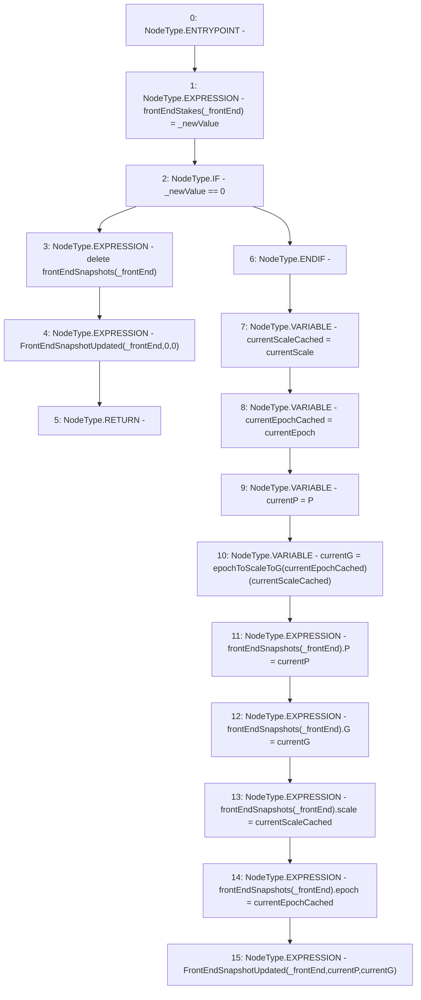

# Context: StabilityPoolTester._updateFrontEndStakeAndSnapshots

**Contract:** `StabilityPoolTester` (Inherits: StabilityPool, IStabilityPool, ICollateralReceiver, CheckContract, Ownable, LiquityBase, YetiCustomBase, BaseMath, ILiquityBase)
**Signature:** `_updateFrontEndStakeAndSnapshots(address,uint256)`
**Method Selector ID:** `Internal (No Method ID)`
**Visibility:** `internal`
**Environment-Free:** `Yes`
**Modifiers:** None

### State Variables Interaction
- **Reads:** P, currentEpoch, currentScale, epochToScaleToG, frontEndSnapshots
- **Writes:** frontEndSnapshots, frontEndStakes

### Environment & Verification Flags
- **Uses Foundry Cheatcodes:** No
- **Has Echidna Properties:** No

### Internal Calls Tree
- None

### External Calls / Value Transfers
- None

### Control Flow Graph (CFG)


### Source Mapping
Declared in: `certora-ac-datasets/detasets/web3bugs/dataset/web3bugs/66/packages/contracts/contracts/StabilityPool.sol` on lines **1042** to **1065**

```solidity
    function _updateFrontEndStakeAndSnapshots(address _frontEnd, uint256 _newValue) internal {
        frontEndStakes[_frontEnd] = _newValue;

        if (_newValue == 0) {
            delete frontEndSnapshots[_frontEnd];
            emit FrontEndSnapshotUpdated(_frontEnd, 0, 0);
            return;
        }

        uint128 currentScaleCached = currentScale;
        uint128 currentEpochCached = currentEpoch;
        uint256 currentP = P;

        // Get G for the current epoch and current scale
        uint256 currentG = epochToScaleToG[currentEpochCached][currentScaleCached];

        // Record new snapshots of the latest running product P and sum G for the front end
        frontEndSnapshots[_frontEnd].P = currentP;
        frontEndSnapshots[_frontEnd].G = currentG;
        frontEndSnapshots[_frontEnd].scale = currentScaleCached;
        frontEndSnapshots[_frontEnd].epoch = currentEpochCached;

        emit FrontEndSnapshotUpdated(_frontEnd, currentP, currentG);
    }

```
