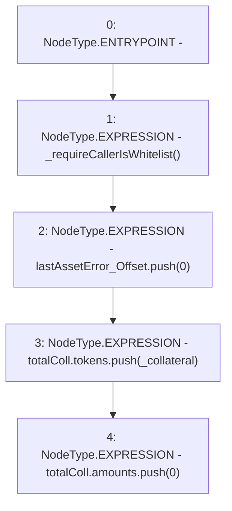

# Context: StabilityPoolTester.addCollateralType

**Contract:** `StabilityPoolTester` (Inherits: StabilityPool, IStabilityPool, ICollateralReceiver, CheckContract, Ownable, LiquityBase, YetiCustomBase, BaseMath, ILiquityBase)
**Signature:** `addCollateralType(address)`
**Method Selector ID:** `0xec0d5e0c`
**Visibility:** `external`
**Environment-Free:** `No (reads EVM state context)`
**Modifiers:** None

### State Variables Interaction
- **Reads:** lastAssetError_Offset, totalColl
- **Writes:** lastAssetError_Offset, totalColl

### Environment & Verification Flags
- **Uses Foundry Cheatcodes:** No
- **Has Echidna Properties:** No

### Internal Calls Tree
- None

### External Calls / Value Transfers
- None

### Control Flow Graph (CFG)


### Source Mapping
Declared in: `certora-ac-datasets/detasets/web3bugs/dataset/web3bugs/66/packages/contracts/contracts/StabilityPool.sol` on lines **1161** to **1166**

```solidity
    function addCollateralType(address _collateral) external override {
        _requireCallerIsWhitelist();
        lastAssetError_Offset.push(0);
        totalColl.tokens.push(_collateral);
        totalColl.amounts.push(0);
    }

```
