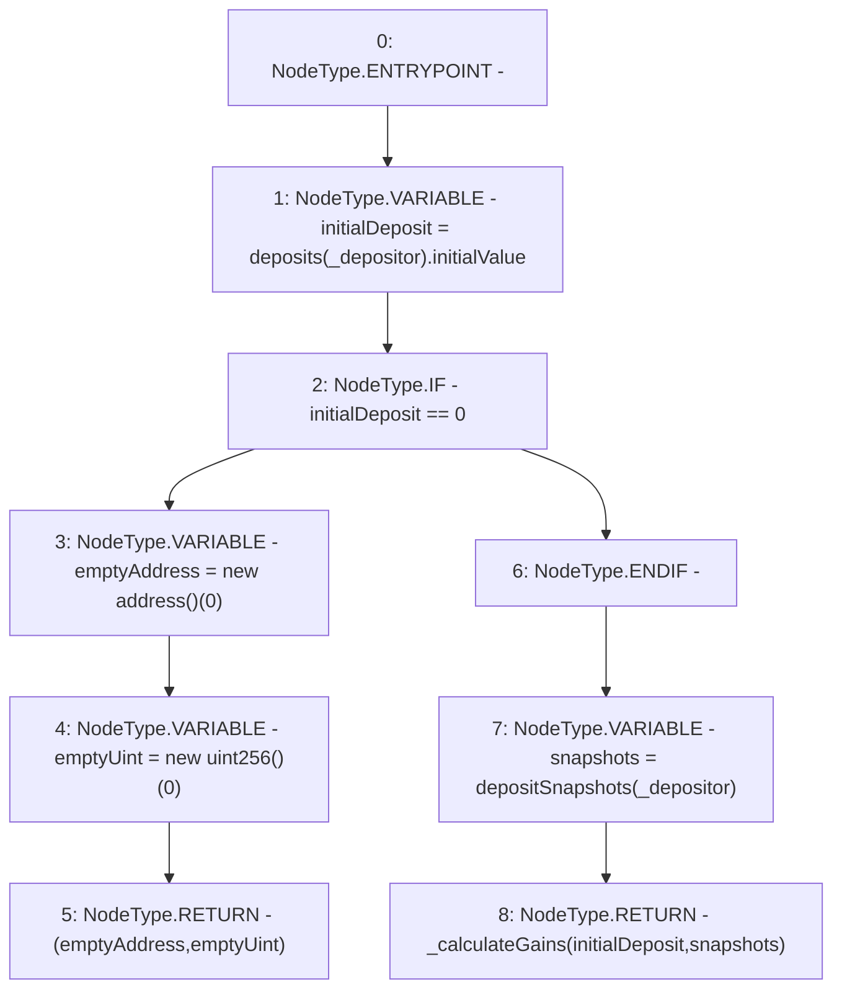

# Context: StabilityPoolTester.getDepositorGains

**Contract:** `StabilityPoolTester` (Inherits: StabilityPool, IStabilityPool, ICollateralReceiver, CheckContract, Ownable, LiquityBase, YetiCustomBase, BaseMath, ILiquityBase)
**Signature:** `getDepositorGains(address) returns (address[], uint256[])`
**Method Selector ID:** `0x792b50e3`
**Visibility:** `public`
**Environment-Free:** `Yes`
**Modifiers:** None

### State Variables Interaction
- **Reads:** depositSnapshots, deposits
- **Writes:** None

### Environment & Verification Flags
- **Uses Foundry Cheatcodes:** No
- **Has Echidna Properties:** No

### Internal Calls Tree
- None

### External Calls / Value Transfers
- None

### Control Flow Graph (CFG)


### Source Mapping
Declared in: `certora-ac-datasets/detasets/web3bugs/dataset/web3bugs/66/packages/contracts/contracts/StabilityPool.sol` on lines **696** to **713**

```solidity
    function getDepositorGains(address _depositor)
        public
        view
        override
        returns (address[] memory, uint256[] memory)
    {
        uint256 initialDeposit = deposits[_depositor].initialValue;

        if (initialDeposit == 0) {
            address[] memory emptyAddress = new address[](0);
            uint256[] memory emptyUint = new uint256[](0);
            return (emptyAddress, emptyUint);
        }

        Snapshots storage snapshots = depositSnapshots[_depositor];

        return _calculateGains(initialDeposit, snapshots);
    }

```
