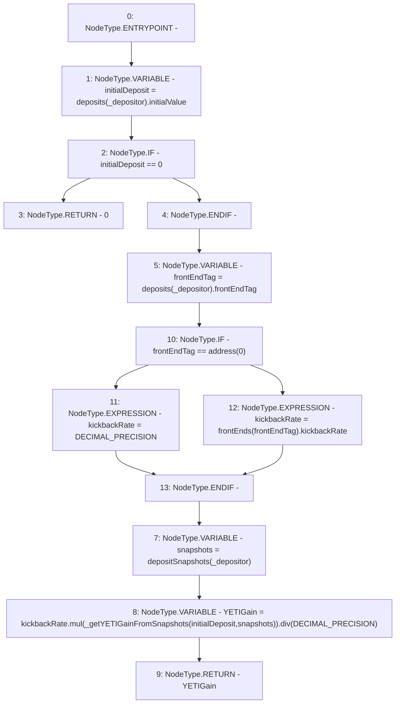

# Context: StabilityPoolTester.getDepositorYETIGain

**Contract:** `StabilityPoolTester` (Inherits: StabilityPool, IStabilityPool, ICollateralReceiver, CheckContract, Ownable, LiquityBase, YetiCustomBase, BaseMath, ILiquityBase)
**Signature:** `getDepositorYETIGain(address) returns (uint256)`
**Method Selector ID:** `0xf7094b0b`
**Visibility:** `public`
**Environment-Free:** `Yes`
**Modifiers:** None

### State Variables Interaction
- **Reads:** DECIMAL_PRECISION, depositSnapshots, deposits, frontEnds
- **Writes:** None

### Environment & Verification Flags
- **Uses Foundry Cheatcodes:** No
- **Has Echidna Properties:** No

### Internal Calls Tree
- None

### External Calls / Value Transfers
- `SafeMath.TMP_819(uint256) = LIBRARY_CALL, dest:SafeMath, function:SafeMath.mul(uint256,uint256), arguments:['kickbackRate', 'TMP_818'] `
- `SafeMath.TMP_820(uint256) = LIBRARY_CALL, dest:SafeMath, function:SafeMath.div(uint256,uint256), arguments:['TMP_819', 'DECIMAL_PRECISION'] `

### Control Flow Graph (CFG)


### Source Mapping
Declared in: `certora-ac-datasets/detasets/web3bugs/dataset/web3bugs/66/packages/contracts/contracts/StabilityPool.sol` on lines **764** to **788**

```solidity
    function getDepositorYETIGain(address _depositor) public view override returns (uint256) {
        uint256 initialDeposit = deposits[_depositor].initialValue;
        if (initialDeposit == 0) {
            return 0;
        }

        address frontEndTag = deposits[_depositor].frontEndTag;

        /*
         * If not tagged with a front end, the depositor gets a 100% cut of what their deposit earned.
         * Otherwise, their cut of the deposit's earnings is equal to the kickbackRate, set by the front end through
         * which they made their deposit.
         */
        uint256 kickbackRate = frontEndTag == address(0)
            ? DECIMAL_PRECISION
            : frontEnds[frontEndTag].kickbackRate;

        Snapshots storage snapshots = depositSnapshots[_depositor];

        uint256 YETIGain = kickbackRate
            .mul(_getYETIGainFromSnapshots(initialDeposit, snapshots))
            .div(DECIMAL_PRECISION);

        return YETIGain;
    }

```
