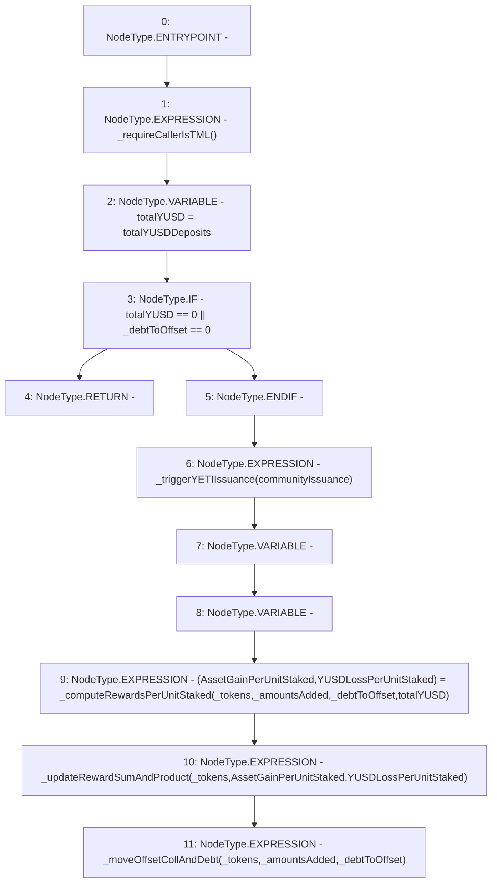

# Context: StabilityPoolTester.offset

**Contract:** `StabilityPoolTester` (Inherits: StabilityPool, IStabilityPool, ICollateralReceiver, CheckContract, Ownable, LiquityBase, YetiCustomBase, BaseMath, ILiquityBase)
**Signature:** `offset(uint256,address[],uint256[])`
**Method Selector ID:** `0x768cc575`
**Visibility:** `external`
**Environment-Free:** `No (reads EVM state context)`
**Modifiers:** None

### State Variables Interaction
- **Reads:** communityIssuance, totalYUSDDeposits
- **Writes:** None

### Environment & Verification Flags
- **Uses Foundry Cheatcodes:** No
- **Has Echidna Properties:** No

### Internal Calls Tree
- None

### External Calls / Value Transfers
- None

### Control Flow Graph (CFG)


### Source Mapping
Declared in: `certora-ac-datasets/detasets/web3bugs/dataset/web3bugs/66/packages/contracts/contracts/StabilityPool.sol` on lines **519** to **539**

```solidity
    function offset(
        uint256 _debtToOffset,
        address[] memory _tokens,
        uint256[] memory _amountsAdded
    ) external override {
        _requireCallerIsTML();
        uint256 totalYUSD = totalYUSDDeposits; // cached to save an SLOAD
        if (totalYUSD == 0 || _debtToOffset == 0) {
            return;
        }

        _triggerYETIIssuance(communityIssuance);

        (
            uint256[] memory AssetGainPerUnitStaked,
            uint256 YUSDLossPerUnitStaked
        ) = _computeRewardsPerUnitStaked(_tokens, _amountsAdded, _debtToOffset, totalYUSD);

        _updateRewardSumAndProduct(_tokens, AssetGainPerUnitStaked, YUSDLossPerUnitStaked); // updates S and P
        _moveOffsetCollAndDebt(_tokens, _amountsAdded, _debtToOffset);
    }

```
