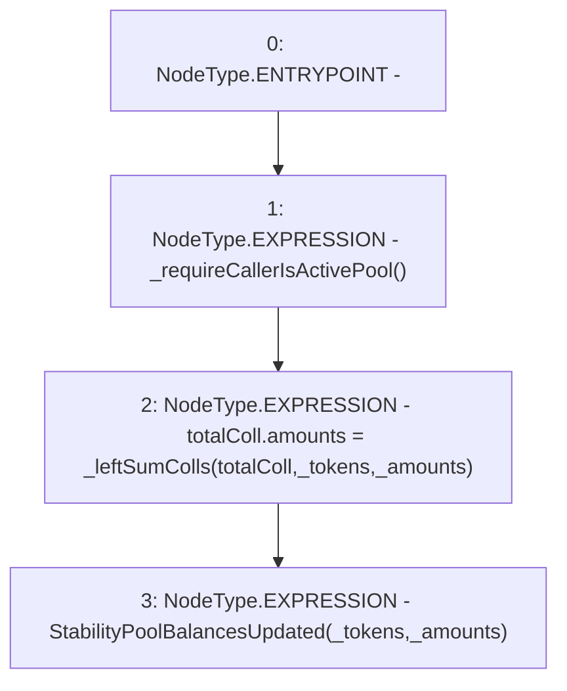

# Context: StabilityPoolTester.receiveCollateral

**Contract:** `StabilityPoolTester` (Inherits: StabilityPool, IStabilityPool, ICollateralReceiver, CheckContract, Ownable, LiquityBase, YetiCustomBase, BaseMath, ILiquityBase)
**Signature:** `receiveCollateral(address[],uint256[])`
**Method Selector ID:** `0xa7a24edd`
**Visibility:** `external`
**Environment-Free:** `No (reads EVM state context)`
**Modifiers:** None

### State Variables Interaction
- **Reads:** totalColl
- **Writes:** totalColl

### Environment & Verification Flags
- **Uses Foundry Cheatcodes:** No
- **Has Echidna Properties:** No

### Internal Calls Tree
- None

### External Calls / Value Transfers
- None

### Control Flow Graph (CFG)


### Source Mapping
Declared in: `certora-ac-datasets/detasets/web3bugs/dataset/web3bugs/66/packages/contracts/contracts/StabilityPool.sol` on lines **1151** to **1158**

```solidity
    function receiveCollateral(address[] memory _tokens, uint256[] memory _amounts)
        external
        override
    {
        _requireCallerIsActivePool();
        totalColl.amounts = _leftSumColls(totalColl, _tokens, _amounts);
        emit StabilityPoolBalancesUpdated(_tokens, _amounts);
    }

```
