# Context: StabilityPoolTester.setAddresses

**Contract:** `StabilityPoolTester` (Inherits: StabilityPool, IStabilityPool, ICollateralReceiver, CheckContract, Ownable, LiquityBase, YetiCustomBase, BaseMath, ILiquityBase)
**Signature:** `setAddresses(address,address,address,address,address,address,address,address)`
**Method Selector ID:** `0xd733cfd0`
**Visibility:** `external`
**Environment-Free:** `No (reads EVM state context)`
**Modifiers:**
- `onlyOwner`
  ```solidity
  modifier onlyOwner() {
          require(isOwner(), "CallerNotOwner");
          _;
      }
  ```

### State Variables Interaction
- **Reads:** None
- **Writes:** activePool, borrowerOperations, communityIssuance, sortedTroves, troveManager, troveManagerLiquidationsAddress, whitelist, whitelistAddress, yusdToken

### Environment & Verification Flags
- **Uses Foundry Cheatcodes:** No
- **Has Echidna Properties:** No

### Internal Calls Tree
- None

### External Calls / Value Transfers
- None

### Control Flow Graph (CFG)

```mermaid
flowchart TD
    Node_0["0: NodeType.ENTRYPOINT - "]
    Node_0 --> Node_25
    Node_1["1: NodeType.EXPRESSION - checkContract(_borrowerOperationsAddress)"]
    Node_1 --> Node_2
    Node_2["2: NodeType.EXPRESSION - checkContract(_troveManagerAddress)"]
    Node_2 --> Node_3
    Node_3["3: NodeType.EXPRESSION - checkContract(_activePoolAddress)"]
    Node_3 --> Node_4
    Node_4["4: NodeType.EXPRESSION - checkContract(_yusdTokenAddress)"]
    Node_4 --> Node_5
    Node_5["5: NodeType.EXPRESSION - checkContract(_sortedTrovesAddress)"]
    Node_5 --> Node_6
    Node_6["6: NodeType.EXPRESSION - checkContract(_communityIssuanceAddress)"]
    Node_6 --> Node_7
    Node_7["7: NodeType.EXPRESSION - checkContract(_whitelistAddress)"]
    Node_7 --> Node_8
    Node_8["8: NodeType.EXPRESSION - checkContract(_troveManagerLiquidationsAddress)"]
    Node_8 --> Node_9
    Node_9["9: NodeType.EXPRESSION - borrowerOperations = IBorrowerOperations(_borrowerOperationsAddress)"]
    Node_9 --> Node_10
    Node_10["10: NodeType.EXPRESSION - troveManager = ITroveManager(_troveManagerAddress)"]
    Node_10 --> Node_11
    Node_11["11: NodeType.EXPRESSION - activePool = IActivePool(_activePoolAddress)"]
    Node_11 --> Node_12
    Node_12["12: NodeType.EXPRESSION - yusdToken = IYUSDToken(_yusdTokenAddress)"]
    Node_12 --> Node_13
    Node_13["13: NodeType.EXPRESSION - sortedTroves = ISortedTroves(_sortedTrovesAddress)"]
    Node_13 --> Node_14
    Node_14["14: NodeType.EXPRESSION - communityIssuance = ICommunityIssuance(_communityIssuanceAddress)"]
    Node_14 --> Node_15
    Node_15["15: NodeType.EXPRESSION - whitelist = IWhitelist(_whitelistAddress)"]
    Node_15 --> Node_16
    Node_16["16: NodeType.EXPRESSION - troveManagerLiquidationsAddress = _troveManagerLiquidationsAddress"]
    Node_16 --> Node_17
    Node_17["17: NodeType.EXPRESSION - whitelistAddress = _whitelistAddress"]
    Node_17 --> Node_18
    Node_18["18: NodeType.EXPRESSION - BorrowerOperationsAddressChanged(_borrowerOperationsAddress)"]
    Node_18 --> Node_19
    Node_19["19: NodeType.EXPRESSION - TroveManagerAddressChanged(_troveManagerAddress)"]
    Node_19 --> Node_20
    Node_20["20: NodeType.EXPRESSION - ActivePoolAddressChanged(_activePoolAddress)"]
    Node_20 --> Node_21
    Node_21["21: NodeType.EXPRESSION - YUSDTokenAddressChanged(_yusdTokenAddress)"]
    Node_21 --> Node_22
    Node_22["22: NodeType.EXPRESSION - SortedTrovesAddressChanged(_sortedTrovesAddress)"]
    Node_22 --> Node_23
    Node_23["23: NodeType.EXPRESSION - CommunityIssuanceAddressChanged(_communityIssuanceAddress)"]
    Node_23 --> Node_24
    Node_24["24: NodeType.EXPRESSION - _renounceOwnership()"]
    Node_25["25: NodeType.EXPRESSION - onlyOwner()"]
    Node_25 --> Node_1
```


### Source Mapping
Declared in: `certora-ac-datasets/detasets/web3bugs/dataset/web3bugs/66/packages/contracts/contracts/StabilityPool.sol` on lines **297** to **335**

```solidity
    function setAddresses(
        address _borrowerOperationsAddress,
        address _troveManagerAddress,
        address _activePoolAddress,
        address _yusdTokenAddress,
        address _sortedTrovesAddress,
        address _communityIssuanceAddress,
        address _whitelistAddress,
        address _troveManagerLiquidationsAddress
    ) external override onlyOwner {
        checkContract(_borrowerOperationsAddress);
        checkContract(_troveManagerAddress);
        checkContract(_activePoolAddress);
        checkContract(_yusdTokenAddress);
        checkContract(_sortedTrovesAddress);
        checkContract(_communityIssuanceAddress);
        checkContract(_whitelistAddress);
        checkContract(_troveManagerLiquidationsAddress);

        borrowerOperations = IBorrowerOperations(_borrowerOperationsAddress);
        troveManager = ITroveManager(_troveManagerAddress);
        activePool = IActivePool(_activePoolAddress);
        yusdToken = IYUSDToken(_yusdTokenAddress);
        sortedTroves = ISortedTroves(_sortedTrovesAddress);
        communityIssuance = ICommunityIssuance(_communityIssuanceAddress);
        whitelist = IWhitelist(_whitelistAddress);

        troveManagerLiquidationsAddress = _troveManagerLiquidationsAddress;
        whitelistAddress = _whitelistAddress;

        emit BorrowerOperationsAddressChanged(_borrowerOperationsAddress);
        emit TroveManagerAddressChanged(_troveManagerAddress);
        emit ActivePoolAddressChanged(_activePoolAddress);
        emit YUSDTokenAddressChanged(_yusdTokenAddress);
        emit SortedTrovesAddressChanged(_sortedTrovesAddress);
        emit CommunityIssuanceAddressChanged(_communityIssuanceAddress);

        _renounceOwnership();
    }

```
