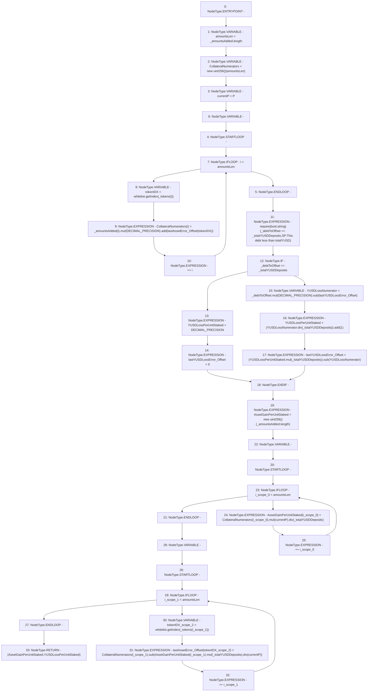

# Context: StabilityPool._computeRewardsPerUnitStaked

**Contract:** `StabilityPool` (Inherits: IStabilityPool, ICollateralReceiver, CheckContract, Ownable, LiquityBase, YetiCustomBase, BaseMath, ILiquityBase)
**Signature:** `_computeRewardsPerUnitStaked(address[],uint256[],uint256,uint256) returns (uint256[], uint256)`
**Method Selector ID:** `Internal (No Method ID)`
**Visibility:** `internal`
**Environment-Free:** `Yes`
**Modifiers:** None

### State Variables Interaction
- **Reads:** DECIMAL_PRECISION, P, lastAssetError_Offset, lastYUSDLossError_Offset, whitelist
- **Writes:** lastAssetError_Offset, lastYUSDLossError_Offset

### Assertion Checks & Business Requirements
- require/assert: `require(bool,string)(_debtToOffset <= _totalYUSDDeposits,SP:This debt less than totalYUSD)`

### Environment & Verification Flags
- **Uses Foundry Cheatcodes:** No
- **Has Echidna Properties:** No

### Internal Calls Tree
- None

### External Calls / Value Transfers
- `SafeMath.TMP_484(uint256) = LIBRARY_CALL, dest:SafeMath, function:SafeMath.mul(uint256,uint256), arguments:['REF_478', '_totalYUSDDeposits'] `
- `SafeMath.TMP_466(uint256) = LIBRARY_CALL, dest:SafeMath, function:SafeMath.mul(uint256,uint256), arguments:['REF_458', 'DECIMAL_PRECISION'] `
- `SafeMath.TMP_472(uint256) = LIBRARY_CALL, dest:SafeMath, function:SafeMath.sub(uint256,uint256), arguments:['TMP_471', 'lastYUSDLossError_Offset'] `
- `SafeMath.TMP_476(uint256) = LIBRARY_CALL, dest:SafeMath, function:SafeMath.sub(uint256,uint256), arguments:['TMP_475', 'YUSDLossNumerator'] `
- `SafeMath.TMP_474(uint256) = LIBRARY_CALL, dest:SafeMath, function:SafeMath.add(uint256,uint256), arguments:['TMP_473', '1'] `
- `SafeMath.TMP_473(uint256) = LIBRARY_CALL, dest:SafeMath, function:SafeMath.div(uint256,uint256), arguments:['YUSDLossNumerator', '_totalYUSDDeposits'] `
- `SafeMath.TMP_467(uint256) = LIBRARY_CALL, dest:SafeMath, function:SafeMath.add(uint256,uint256), arguments:['TMP_466', 'REF_461'] `
- `SafeMath.TMP_481(uint256) = LIBRARY_CALL, dest:SafeMath, function:SafeMath.div(uint256,uint256), arguments:['TMP_480', '_totalYUSDDeposits'] `
- `SafeMath.TMP_480(uint256) = LIBRARY_CALL, dest:SafeMath, function:SafeMath.mul(uint256,uint256), arguments:['REF_470', 'currentP'] `
- `SafeMath.TMP_471(uint256) = LIBRARY_CALL, dest:SafeMath, function:SafeMath.mul(uint256,uint256), arguments:['_debtToOffset', 'DECIMAL_PRECISION'] `
- `SafeMath.TMP_485(uint256) = LIBRARY_CALL, dest:SafeMath, function:SafeMath.div(uint256,uint256), arguments:['TMP_484', 'currentP'] `
- `SafeMath.TMP_475(uint256) = LIBRARY_CALL, dest:SafeMath, function:SafeMath.mul(uint256,uint256), arguments:['YUSDLossPerUnitStaked', '_totalYUSDDeposits'] `
- `SafeMath.TMP_486(uint256) = LIBRARY_CALL, dest:SafeMath, function:SafeMath.sub(uint256,uint256), arguments:['REF_476', 'TMP_485'] `
- `IWhitelist.TMP_483(uint256) = HIGH_LEVEL_CALL, dest:whitelist(IWhitelist), function:getIndex, arguments:['REF_474']  `
- `IWhitelist.TMP_465(uint256) = HIGH_LEVEL_CALL, dest:whitelist(IWhitelist), function:getIndex, arguments:['REF_456']  `

### Control Flow Graph (CFG)


### Source Mapping
Declared in: `certora-ac-datasets/detasets/web3bugs/dataset/web3bugs/66/packages/contracts/contracts/StabilityPool.sol` on lines **555** to **602**

```solidity
    function _computeRewardsPerUnitStaked(
        address[] memory _tokens,
        uint256[] memory _amountsAdded,
        uint256 _debtToOffset,
        uint256 _totalYUSDDeposits
    ) internal returns (uint256[] memory AssetGainPerUnitStaked, uint256 YUSDLossPerUnitStaked) {
        uint256 amountsLen = _amountsAdded.length;
        uint256[] memory CollateralNumerators = new uint256[](amountsLen);
        uint256 currentP = P;

        for (uint256 i; i < amountsLen; ++i) {
            uint256 tokenIDX = whitelist.getIndex(_tokens[i]);
            CollateralNumerators[i] = _amountsAdded[i].mul(DECIMAL_PRECISION).add(
                lastAssetError_Offset[tokenIDX]
            );
        }

        require(_debtToOffset <= _totalYUSDDeposits, "SP:This debt less than totalYUSD");
        if (_debtToOffset == _totalYUSDDeposits) {
            YUSDLossPerUnitStaked = DECIMAL_PRECISION; // When the Pool depletes to 0, so does each deposit
            lastYUSDLossError_Offset = 0;
        } else {
            uint256 YUSDLossNumerator = _debtToOffset.mul(DECIMAL_PRECISION).sub(
                lastYUSDLossError_Offset
            );
            /*
             * Add 1 to make error in quotient positive. We want "slightly too much" YUSD loss,
             * which ensures the error in any given compoundedYUSDDeposit favors the Stability Pool.
             */
            YUSDLossPerUnitStaked = (YUSDLossNumerator.div(_totalYUSDDeposits)).add(1);
            lastYUSDLossError_Offset = (YUSDLossPerUnitStaked.mul(_totalYUSDDeposits)).sub(
                YUSDLossNumerator
            );
        }

        AssetGainPerUnitStaked = new uint256[](_amountsAdded.length);
        for (uint256 i; i < amountsLen; ++i) {
            AssetGainPerUnitStaked[i] = CollateralNumerators[i].mul(currentP).div(_totalYUSDDeposits);
        }

        for (uint256 i; i < amountsLen; ++i) {
            uint256 tokenIDX = whitelist.getIndex(_tokens[i]);
            lastAssetError_Offset[tokenIDX] = CollateralNumerators[i].sub(
                AssetGainPerUnitStaked[i].mul(_totalYUSDDeposits).div(currentP)
            );
        }

    }

```
