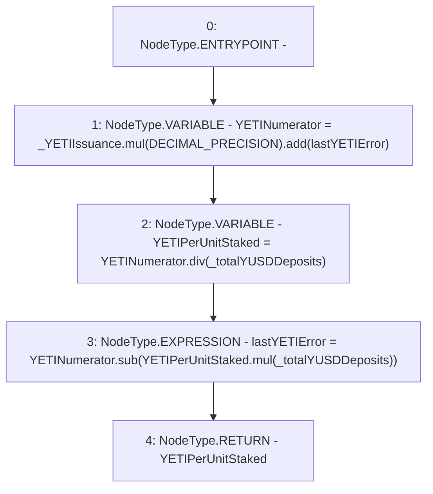

# Context: StabilityPool._computeYETIPerUnitStaked

**Contract:** `StabilityPool` (Inherits: IStabilityPool, ICollateralReceiver, CheckContract, Ownable, LiquityBase, YetiCustomBase, BaseMath, ILiquityBase)
**Signature:** `_computeYETIPerUnitStaked(uint256,uint256) returns (uint256)`
**Method Selector ID:** `Internal (No Method ID)`
**Visibility:** `internal`
**Environment-Free:** `Yes`
**Modifiers:** None

### State Variables Interaction
- **Reads:** DECIMAL_PRECISION, lastYETIError
- **Writes:** lastYETIError

### Environment & Verification Flags
- **Uses Foundry Cheatcodes:** No
- **Has Echidna Properties:** No

### Internal Calls Tree
- None

### External Calls / Value Transfers
- `SafeMath.TMP_454(uint256) = LIBRARY_CALL, dest:SafeMath, function:SafeMath.sub(uint256,uint256), arguments:['YETINumerator', 'TMP_453'] `
- `SafeMath.TMP_452(uint256) = LIBRARY_CALL, dest:SafeMath, function:SafeMath.div(uint256,uint256), arguments:['YETINumerator', '_totalYUSDDeposits'] `
- `SafeMath.TMP_451(uint256) = LIBRARY_CALL, dest:SafeMath, function:SafeMath.add(uint256,uint256), arguments:['TMP_450', 'lastYETIError'] `
- `SafeMath.TMP_453(uint256) = LIBRARY_CALL, dest:SafeMath, function:SafeMath.mul(uint256,uint256), arguments:['YETIPerUnitStaked', '_totalYUSDDeposits'] `
- `SafeMath.TMP_450(uint256) = LIBRARY_CALL, dest:SafeMath, function:SafeMath.mul(uint256,uint256), arguments:['_YETIIssuance', 'DECIMAL_PRECISION'] `

### Control Flow Graph (CFG)


### Source Mapping
Declared in: `certora-ac-datasets/detasets/web3bugs/dataset/web3bugs/66/packages/contracts/contracts/StabilityPool.sol` on lines **489** to **510**

```solidity
    function _computeYETIPerUnitStaked(uint256 _YETIIssuance, uint256 _totalYUSDDeposits)
        internal
        returns (uint256)
    {
        /*
         * Calculate the YETI-per-unit staked.  Division uses a "feedback" error correction, to keep the
         * cumulative error low in the running total G:
         *
         * 1) Form a numerator which compensates for the floor division error that occurred the last time this
         * function was called.
         * 2) Calculate "per-unit-staked" ratio.
         * 3) Multiply the ratio back by its denominator, to reveal the current floor division error.
         * 4) Store this error for use in the next correction when this function is called.
         * 5) Note: static analysis tools complain about this "division before multiplication", however, it is intended.
         */
        uint256 YETINumerator = _YETIIssuance.mul(DECIMAL_PRECISION).add(lastYETIError);

        uint256 YETIPerUnitStaked = YETINumerator.div(_totalYUSDDeposits);
        lastYETIError = YETINumerator.sub(YETIPerUnitStaked.mul(_totalYUSDDeposits));

        return YETIPerUnitStaked;
    }

```
