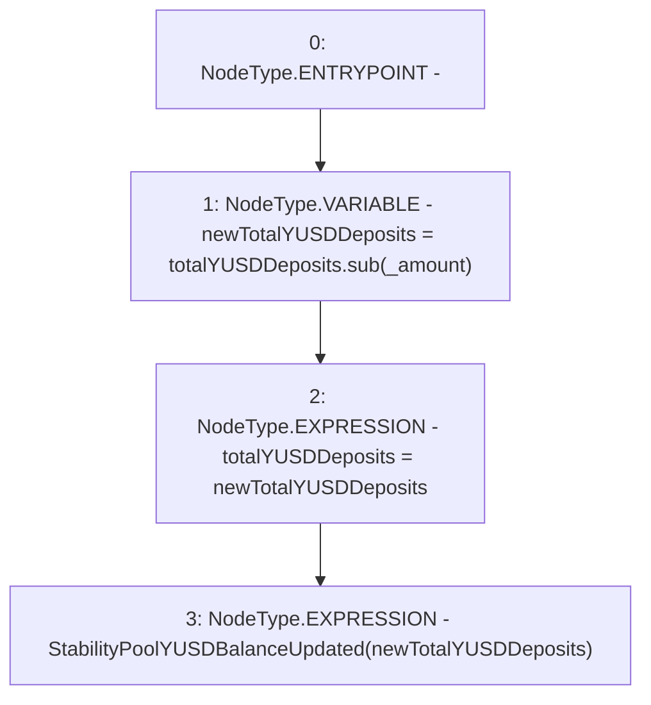

# Context: StabilityPool._decreaseYUSD

**Contract:** `StabilityPool` (Inherits: IStabilityPool, ICollateralReceiver, CheckContract, Ownable, LiquityBase, YetiCustomBase, BaseMath, ILiquityBase)
**Signature:** `_decreaseYUSD(uint256)`
**Method Selector ID:** `Internal (No Method ID)`
**Visibility:** `internal`
**Environment-Free:** `Yes`
**Modifiers:** None

### State Variables Interaction
- **Reads:** totalYUSDDeposits
- **Writes:** totalYUSDDeposits

### Environment & Verification Flags
- **Uses Foundry Cheatcodes:** No
- **Has Echidna Properties:** No

### Internal Calls Tree
- None

### External Calls / Value Transfers
- `SafeMath.TMP_517(uint256) = LIBRARY_CALL, dest:SafeMath, function:SafeMath.sub(uint256,uint256), arguments:['totalYUSDDeposits', '_amount'] `

### Control Flow Graph (CFG)


### Source Mapping
Declared in: `certora-ac-datasets/detasets/web3bugs/dataset/web3bugs/66/packages/contracts/contracts/StabilityPool.sol` on lines **682** to **686**

```solidity
    function _decreaseYUSD(uint256 _amount) internal {
        uint256 newTotalYUSDDeposits = totalYUSDDeposits.sub(_amount);
        totalYUSDDeposits = newTotalYUSDDeposits;
        emit StabilityPoolYUSDBalanceUpdated(newTotalYUSDDeposits);
    }

```
