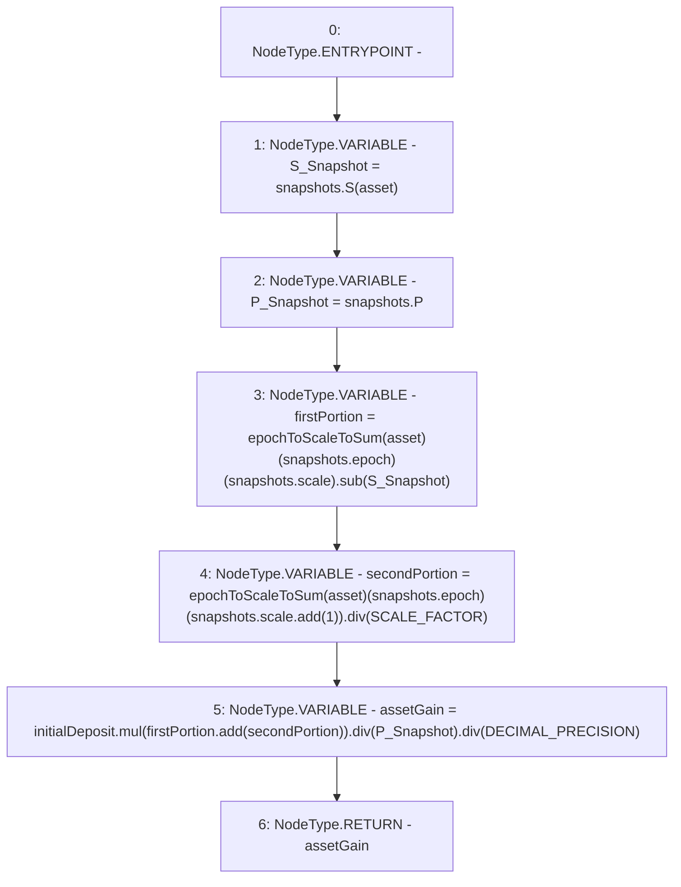

# Context: StabilityPool._getGainFromSnapshots

**Contract:** `StabilityPool` (Inherits: IStabilityPool, ICollateralReceiver, CheckContract, Ownable, LiquityBase, YetiCustomBase, BaseMath, ILiquityBase)
**Signature:** `_getGainFromSnapshots(uint256,StabilityPool.Snapshots,address) returns (uint256)`
**Method Selector ID:** `Internal (No Method ID)`
**Visibility:** `internal`
**Environment-Free:** `Yes`
**Modifiers:** None

### State Variables Interaction
- **Reads:** DECIMAL_PRECISION, SCALE_FACTOR, depositSnapshots, epochToScaleToSum
- **Writes:** None

### Environment & Verification Flags
- **Uses Foundry Cheatcodes:** No
- **Has Echidna Properties:** No

### Internal Calls Tree
- None

### External Calls / Value Transfers
- `SafeMath.TMP_533(uint256) = LIBRARY_CALL, dest:SafeMath, function:SafeMath.mul(uint256,uint256), arguments:['initialDeposit', 'TMP_532'] `
- `SafeMath.TMP_529(uint256) = LIBRARY_CALL, dest:SafeMath, function:SafeMath.sub(uint256,uint256), arguments:['REF_519', 'S_Snapshot'] `
- `LiquitySafeMath128.TMP_530(uint128) = LIBRARY_CALL, dest:LiquitySafeMath128, function:LiquitySafeMath128.add(uint128,uint128), arguments:['REF_524', '1'] `
- `SafeMath.TMP_532(uint256) = LIBRARY_CALL, dest:SafeMath, function:SafeMath.add(uint256,uint256), arguments:['firstPortion', 'secondPortion'] `
- `SafeMath.TMP_535(uint256) = LIBRARY_CALL, dest:SafeMath, function:SafeMath.div(uint256,uint256), arguments:['TMP_534', 'DECIMAL_PRECISION'] `
- `SafeMath.TMP_534(uint256) = LIBRARY_CALL, dest:SafeMath, function:SafeMath.div(uint256,uint256), arguments:['TMP_533', 'P_Snapshot'] `
- `SafeMath.TMP_531(uint256) = LIBRARY_CALL, dest:SafeMath, function:SafeMath.div(uint256,uint256), arguments:['REF_526', 'SCALE_FACTOR'] `

### Control Flow Graph (CFG)


### Source Mapping
Declared in: `certora-ac-datasets/detasets/web3bugs/dataset/web3bugs/66/packages/contracts/contracts/StabilityPool.sol` on lines **732** to **756**

```solidity
    function _getGainFromSnapshots(
        uint256 initialDeposit,
        Snapshots storage snapshots,
        address asset
    ) internal view returns (uint256) {
        /*
         * Grab the sum 'S' from the epoch at which the stake was made. The Collateral amount gain may span up to one scale change.
         * If it does, the second portion of the Collateral amount gain is scaled by 1e9.
         * If the gain spans no scale change, the second portion will be 0.
         */
        uint256 S_Snapshot = snapshots.S[asset];
        uint256 P_Snapshot = snapshots.P;

        uint256 firstPortion = epochToScaleToSum[asset][snapshots.epoch][snapshots.scale].sub(
            S_Snapshot
        );        
        uint256 secondPortion = epochToScaleToSum[asset][snapshots.epoch][snapshots.scale.add(1)]
            .div(SCALE_FACTOR);

        uint256 assetGain = initialDeposit.mul(firstPortion.add(secondPortion)).div(P_Snapshot).div(
            DECIMAL_PRECISION
        );
        
        return assetGain;
    }

```
