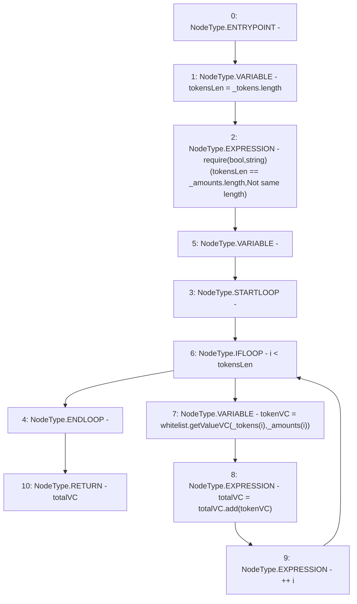

# Context: StabilityPool._getVC

**Contract:** `StabilityPool` (Inherits: IStabilityPool, ICollateralReceiver, CheckContract, Ownable, LiquityBase, YetiCustomBase, BaseMath, ILiquityBase)
**Signature:** `_getVC(address[],uint256[]) returns (uint256)`
**Method Selector ID:** `Internal (No Method ID)`
**Visibility:** `internal`
**Environment-Free:** `Yes`
**Modifiers:** None

### State Variables Interaction
- **Reads:** whitelist
- **Writes:** None

### Assertion Checks & Business Requirements
- require/assert: `require(bool,string)(tokensLen == _amounts.length,Not same length)`

### Environment & Verification Flags
- **Uses Foundry Cheatcodes:** No
- **Has Echidna Properties:** No

### Internal Calls Tree
- None

### External Calls / Value Transfers
- `IWhitelist.TMP_300(uint256) = HIGH_LEVEL_CALL, dest:whitelist(IWhitelist), function:getValueVC, arguments:['REF_292', 'REF_293']  `
- `SafeMath.TMP_301(uint256) = LIBRARY_CALL, dest:SafeMath, function:SafeMath.add(uint256,uint256), arguments:['totalVC', 'tokenVC'] `

### Control Flow Graph (CFG)


### Source Mapping
Declared in: `certora-ac-datasets/detasets/web3bugs/dataset/web3bugs/66/packages/contracts/contracts/Dependencies/LiquityBase.sol` on lines **83** to **90**

```solidity
    function _getVC(address[] memory _tokens, uint[] memory _amounts) internal view returns (uint totalVC) {
        uint256 tokensLen = _tokens.length;
        require(tokensLen == _amounts.length, "Not same length");
        for (uint256 i; i < tokensLen; ++i) {
            uint tokenVC = whitelist.getValueVC(_tokens[i], _amounts[i]);
            totalVC = totalVC.add(tokenVC);
        }
    }

```
