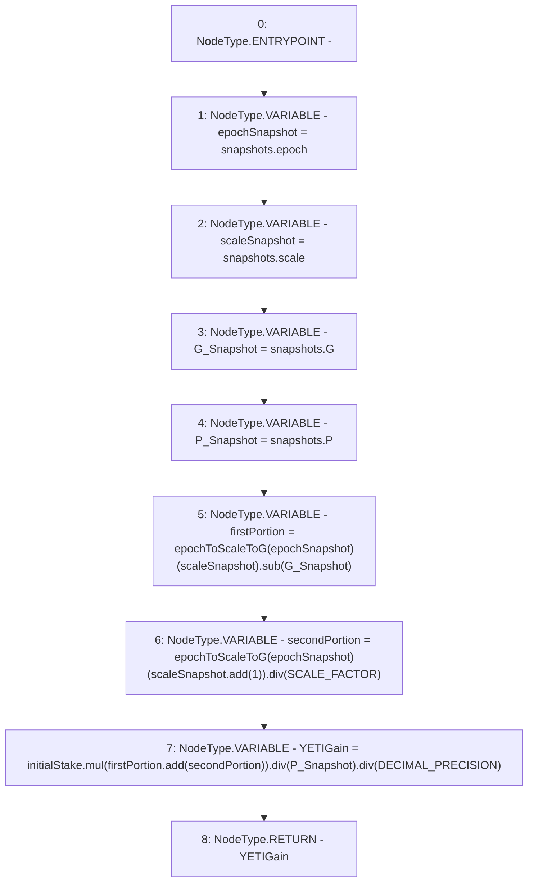

# Context: StabilityPool._getYETIGainFromSnapshots

**Contract:** `StabilityPool` (Inherits: IStabilityPool, ICollateralReceiver, CheckContract, Ownable, LiquityBase, YetiCustomBase, BaseMath, ILiquityBase)
**Signature:** `_getYETIGainFromSnapshots(uint256,StabilityPool.Snapshots) returns (uint256)`
**Method Selector ID:** `Internal (No Method ID)`
**Visibility:** `internal`
**Environment-Free:** `Yes`
**Modifiers:** None

### State Variables Interaction
- **Reads:** DECIMAL_PRECISION, SCALE_FACTOR, depositSnapshots, epochToScaleToG, frontEndSnapshots
- **Writes:** None

### Environment & Verification Flags
- **Uses Foundry Cheatcodes:** No
- **Has Echidna Properties:** No

### Internal Calls Tree
- None

### External Calls / Value Transfers
- `LiquitySafeMath128.TMP_549(uint128) = LIBRARY_CALL, dest:LiquitySafeMath128, function:LiquitySafeMath128.add(uint128,uint128), arguments:['scaleSnapshot', '1'] `
- `SafeMath.TMP_550(uint256) = LIBRARY_CALL, dest:SafeMath, function:SafeMath.div(uint256,uint256), arguments:['REF_557', 'SCALE_FACTOR'] `
- `SafeMath.TMP_554(uint256) = LIBRARY_CALL, dest:SafeMath, function:SafeMath.div(uint256,uint256), arguments:['TMP_553', 'DECIMAL_PRECISION'] `
- `SafeMath.TMP_553(uint256) = LIBRARY_CALL, dest:SafeMath, function:SafeMath.div(uint256,uint256), arguments:['TMP_552', 'P_Snapshot'] `
- `SafeMath.TMP_548(uint256) = LIBRARY_CALL, dest:SafeMath, function:SafeMath.sub(uint256,uint256), arguments:['REF_553', 'G_Snapshot'] `
- `SafeMath.TMP_551(uint256) = LIBRARY_CALL, dest:SafeMath, function:SafeMath.add(uint256,uint256), arguments:['firstPortion', 'secondPortion'] `
- `SafeMath.TMP_552(uint256) = LIBRARY_CALL, dest:SafeMath, function:SafeMath.mul(uint256,uint256), arguments:['initialStake', 'TMP_551'] `

### Control Flow Graph (CFG)


### Source Mapping
Declared in: `certora-ac-datasets/detasets/web3bugs/dataset/web3bugs/66/packages/contracts/contracts/StabilityPool.sol` on lines **813** to **838**

```solidity
    function _getYETIGainFromSnapshots(uint256 initialStake, Snapshots storage snapshots)
        internal
        view
        returns (uint256)
    {
        /*
         * Grab the sum 'G' from the epoch at which the stake was made. The YETI gain may span up to one scale change.
         * If it does, the second portion of the YETI gain is scaled by 1e9.
         * If the gain spans no scale change, the second portion will be 0.
         */
        uint128 epochSnapshot = snapshots.epoch;
        uint128 scaleSnapshot = snapshots.scale;
        uint256 G_Snapshot = snapshots.G;
        uint256 P_Snapshot = snapshots.P;

        uint256 firstPortion = epochToScaleToG[epochSnapshot][scaleSnapshot].sub(G_Snapshot);
        uint256 secondPortion = epochToScaleToG[epochSnapshot][scaleSnapshot.add(1)].div(
            SCALE_FACTOR
        );

        uint256 YETIGain = initialStake.mul(firstPortion.add(secondPortion)).div(P_Snapshot).div(
            DECIMAL_PRECISION
        );

        return YETIGain;
    }

```
