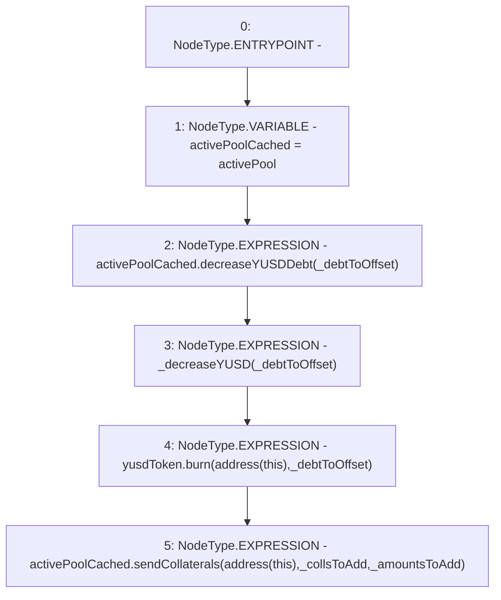

# Context: StabilityPool._moveOffsetCollAndDebt

**Contract:** `StabilityPool` (Inherits: IStabilityPool, ICollateralReceiver, CheckContract, Ownable, LiquityBase, YetiCustomBase, BaseMath, ILiquityBase)
**Signature:** `_moveOffsetCollAndDebt(address[],uint256[],uint256)`
**Method Selector ID:** `Internal (No Method ID)`
**Visibility:** `internal`
**Environment-Free:** `Yes`
**Modifiers:** None

### State Variables Interaction
- **Reads:** activePool, yusdToken
- **Writes:** None

### Environment & Verification Flags
- **Uses Foundry Cheatcodes:** No
- **Has Echidna Properties:** No

### Internal Calls Tree
- None

### External Calls / Value Transfers
- `IActivePool.HIGH_LEVEL_CALL, dest:activePoolCached(IActivePool), function:decreaseYUSDDebt, arguments:['_debtToOffset']  `
- `IActivePool.TMP_516(bool) = HIGH_LEVEL_CALL, dest:activePoolCached(IActivePool), function:sendCollaterals, arguments:['TMP_515', '_collsToAdd', '_amountsToAdd']  `
- `IYUSDToken.HIGH_LEVEL_CALL, dest:yusdToken(IYUSDToken), function:burn, arguments:['TMP_513', '_debtToOffset']  `

### Control Flow Graph (CFG)


### Source Mapping
Declared in: `certora-ac-datasets/detasets/web3bugs/dataset/web3bugs/66/packages/contracts/contracts/StabilityPool.sol` on lines **665** to **679**

```solidity
    function _moveOffsetCollAndDebt(
        address[] memory _collsToAdd,
        uint256[] memory _amountsToAdd,
        uint256 _debtToOffset
    ) internal {
        IActivePool activePoolCached = activePool;
        // Cancel the liquidated YUSD debt with the YUSD in the stability pool
        activePoolCached.decreaseYUSDDebt(_debtToOffset);
        _decreaseYUSD(_debtToOffset);

        // Burn the debt that was successfully offset
        yusdToken.burn(address(this), _debtToOffset);

        activePoolCached.sendCollaterals(address(this), _collsToAdd, _amountsToAdd);
    }

```
