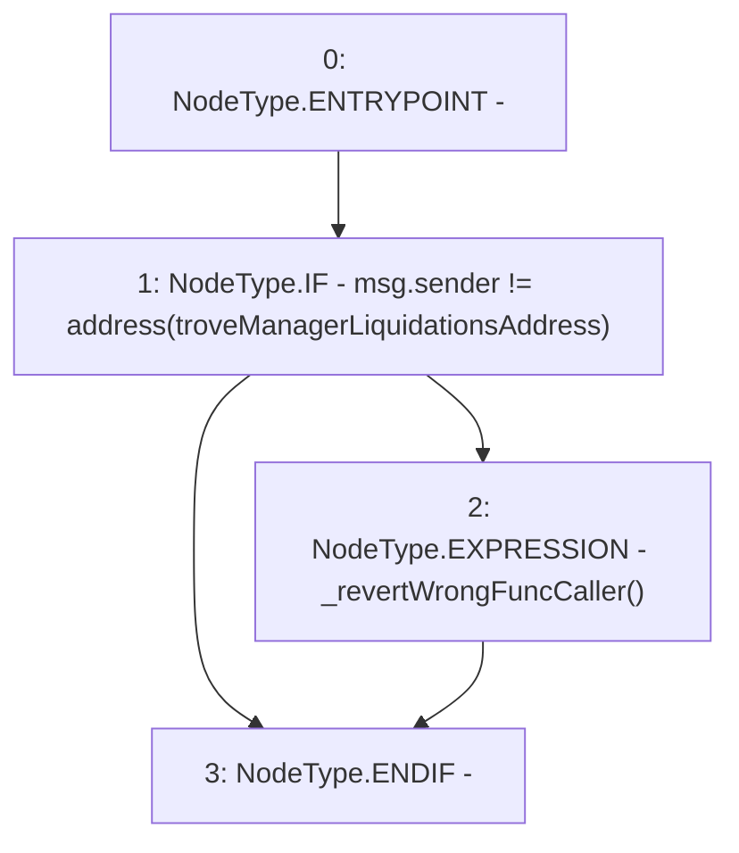

# Context: StabilityPool._requireCallerIsTML

**Contract:** `StabilityPool` (Inherits: IStabilityPool, ICollateralReceiver, CheckContract, Ownable, LiquityBase, YetiCustomBase, BaseMath, ILiquityBase)
**Signature:** `_requireCallerIsTML()`
**Method Selector ID:** `Internal (No Method ID)`
**Visibility:** `internal`
**Environment-Free:** `No (reads EVM state context)`
**Modifiers:** None

### State Variables Interaction
- **Reads:** troveManagerLiquidationsAddress
- **Writes:** None

### Assertion Checks & Business Requirements
- revert: `_revertWrongFuncCaller()`

### Environment & Verification Flags
- **Uses Foundry Cheatcodes:** No
- **Has Echidna Properties:** No

### Internal Calls Tree
- None

### External Calls / Value Transfers
- None

### Control Flow Graph (CFG)


### Source Mapping
Declared in: `certora-ac-datasets/detasets/web3bugs/dataset/web3bugs/66/packages/contracts/contracts/StabilityPool.sol` on lines **1139** to **1143**

```solidity
    function _requireCallerIsTML() internal view {
        if (msg.sender != address(troveManagerLiquidationsAddress)) {
            _revertWrongFuncCaller();
        }
    }

```
