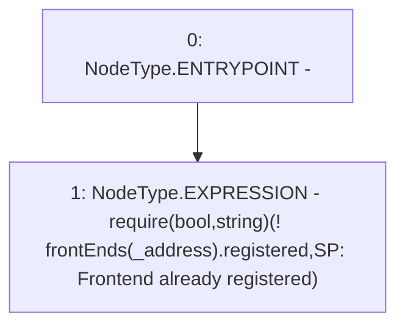

# Context: StabilityPool._requireFrontEndNotRegistered

**Contract:** `StabilityPool` (Inherits: IStabilityPool, ICollateralReceiver, CheckContract, Ownable, LiquityBase, YetiCustomBase, BaseMath, ILiquityBase)
**Signature:** `_requireFrontEndNotRegistered(address)`
**Method Selector ID:** `Internal (No Method ID)`
**Visibility:** `internal`
**Environment-Free:** `Yes`
**Modifiers:** None

### State Variables Interaction
- **Reads:** frontEnds
- **Writes:** None

### Assertion Checks & Business Requirements
- require/assert: `require(bool,string)(! frontEnds[_address].registered,SP: Frontend already registered)`

### Environment & Verification Flags
- **Uses Foundry Cheatcodes:** No
- **Has Echidna Properties:** No

### Internal Calls Tree
- None

### External Calls / Value Transfers
- None

### Control Flow Graph (CFG)


### Source Mapping
Declared in: `certora-ac-datasets/detasets/web3bugs/dataset/web3bugs/66/packages/contracts/contracts/StabilityPool.sol` on lines **1106** to **1111**

```solidity
    function _requireFrontEndNotRegistered(address _address) internal view {
        require(
            !frontEnds[_address].registered,
            "SP: Frontend already registered"
        );
    }

```
