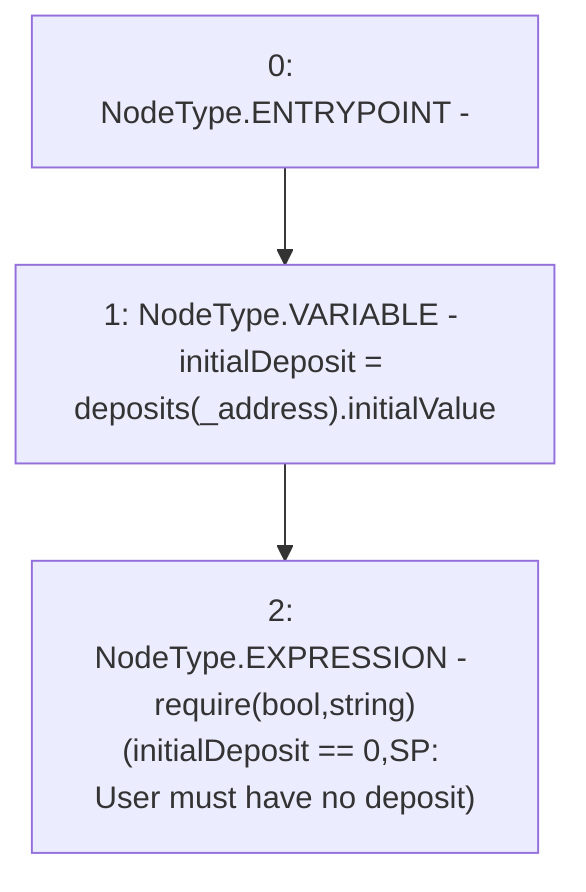

# Context: StabilityPool._requireUserHasNoDeposit

**Contract:** `StabilityPool` (Inherits: IStabilityPool, ICollateralReceiver, CheckContract, Ownable, LiquityBase, YetiCustomBase, BaseMath, ILiquityBase)
**Signature:** `_requireUserHasNoDeposit(address)`
**Method Selector ID:** `Internal (No Method ID)`
**Visibility:** `internal`
**Environment-Free:** `Yes`
**Modifiers:** None

### State Variables Interaction
- **Reads:** deposits
- **Writes:** None

### Assertion Checks & Business Requirements
- require/assert: `require(bool,string)(initialDeposit == 0,SP: User must have no deposit)`

### Environment & Verification Flags
- **Uses Foundry Cheatcodes:** No
- **Has Echidna Properties:** No

### Internal Calls Tree
- None

### External Calls / Value Transfers
- None

### Control Flow Graph (CFG)


### Source Mapping
Declared in: `certora-ac-datasets/detasets/web3bugs/dataset/web3bugs/66/packages/contracts/contracts/StabilityPool.sol` on lines **1097** to **1100**

```solidity
    function _requireUserHasNoDeposit(address _address) internal view {
        uint256 initialDeposit = deposits[_address].initialValue;
        require(initialDeposit == 0, "SP: User must have no deposit");
    }

```
