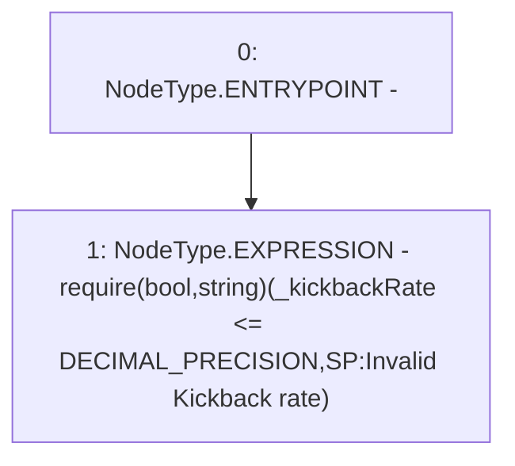

# Context: StabilityPool._requireValidKickbackRate

**Contract:** `StabilityPool` (Inherits: IStabilityPool, ICollateralReceiver, CheckContract, Ownable, LiquityBase, YetiCustomBase, BaseMath, ILiquityBase)
**Signature:** `_requireValidKickbackRate(uint256)`
**Method Selector ID:** `Internal (No Method ID)`
**Visibility:** `internal`
**Environment-Free:** `Yes`
**Modifiers:** None

### State Variables Interaction
- **Reads:** DECIMAL_PRECISION
- **Writes:** None

### Assertion Checks & Business Requirements
- require/assert: `require(bool,string)(_kickbackRate <= DECIMAL_PRECISION,SP:Invalid Kickback rate)`

### Environment & Verification Flags
- **Uses Foundry Cheatcodes:** No
- **Has Echidna Properties:** No

### Internal Calls Tree
- None

### External Calls / Value Transfers
- None

### Control Flow Graph (CFG)


### Source Mapping
Declared in: `certora-ac-datasets/detasets/web3bugs/dataset/web3bugs/66/packages/contracts/contracts/StabilityPool.sol` on lines **1120** to **1125**

```solidity
    function _requireValidKickbackRate(uint256 _kickbackRate) internal pure {
        require(
            _kickbackRate <= DECIMAL_PRECISION,
            "SP:Invalid Kickback rate"
        );
    }

```
