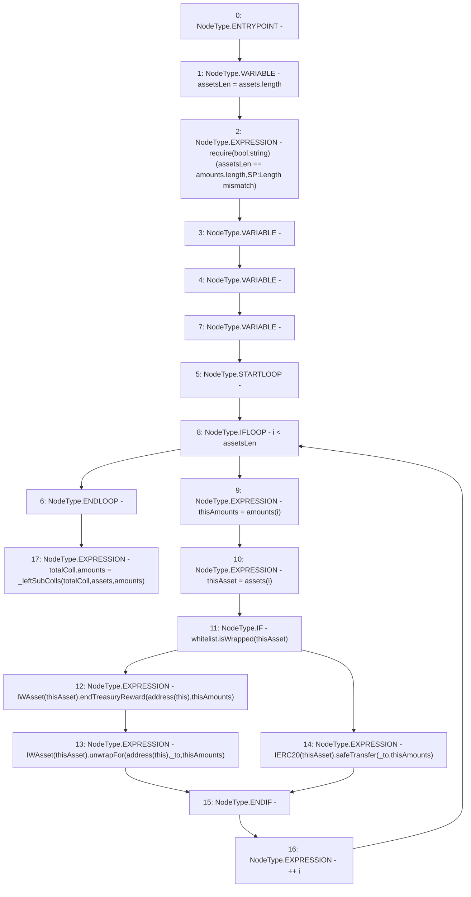

# Context: StabilityPool._sendGainsToDepositor

**Contract:** `StabilityPool` (Inherits: IStabilityPool, ICollateralReceiver, CheckContract, Ownable, LiquityBase, YetiCustomBase, BaseMath, ILiquityBase)
**Signature:** `_sendGainsToDepositor(address,address[],uint256[])`
**Method Selector ID:** `Internal (No Method ID)`
**Visibility:** `internal`
**Environment-Free:** `Yes`
**Modifiers:** None

### State Variables Interaction
- **Reads:** totalColl, whitelist
- **Writes:** totalColl

### Assertion Checks & Business Requirements
- require/assert: `require(bool,string)(assetsLen == amounts.length,SP:Length mismatch)`

### Environment & Verification Flags
- **Uses Foundry Cheatcodes:** No
- **Has Echidna Properties:** No

### Internal Calls Tree
- None

### External Calls / Value Transfers
- `SafeERC20.LIBRARY_CALL, dest:SafeERC20, function:SafeERC20.safeTransfer(IERC20,address,uint256), arguments:['TMP_584', '_to', 'thisAmounts'] `
- `IWAsset.HIGH_LEVEL_CALL, dest:TMP_578(IWAsset), function:endTreasuryReward, arguments:['TMP_579', 'thisAmounts']  `
- `IWAsset.HIGH_LEVEL_CALL, dest:TMP_581(IWAsset), function:unwrapFor, arguments:['TMP_582', '_to', 'thisAmounts']  `
- `IWhitelist.TMP_577(bool) = HIGH_LEVEL_CALL, dest:whitelist(IWhitelist), function:isWrapped, arguments:['thisAsset']  `

### Control Flow Graph (CFG)


### Source Mapping
Declared in: `certora-ac-datasets/detasets/web3bugs/dataset/web3bugs/66/packages/contracts/contracts/StabilityPool.sol` on lines **940** to **962**

```solidity
    function _sendGainsToDepositor(
        address _to,
        address[] memory assets,
        uint256[] memory amounts
    ) internal {
        uint256 assetsLen = assets.length;
        require(assetsLen == amounts.length, "SP:Length mismatch");
        uint256 thisAmounts;
        address thisAsset;
        for (uint256 i; i < assetsLen; ++i) {
            thisAmounts = amounts[i];
            thisAsset = assets[i];
            if (whitelist.isWrapped(thisAsset)) {
                // In this case update the rewards from the treasury to the caller 
                IWAsset(thisAsset).endTreasuryReward(address(this), thisAmounts);
                // unwrapFor ends the rewards for the caller and transfers the tokens to the _to param. 
                IWAsset(thisAsset).unwrapFor(address(this), _to, thisAmounts);
            } else {
                IERC20(thisAsset).safeTransfer(_to, thisAmounts);
            }
        }
        totalColl.amounts = _leftSubColls(totalColl, assets, amounts);
    }

```
