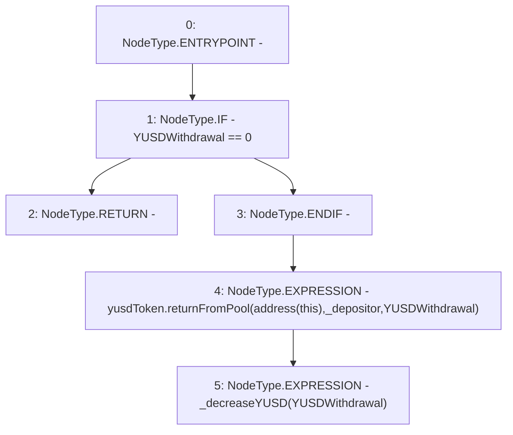

# Context: StabilityPool._sendYUSDToDepositor

**Contract:** `StabilityPool` (Inherits: IStabilityPool, ICollateralReceiver, CheckContract, Ownable, LiquityBase, YetiCustomBase, BaseMath, ILiquityBase)
**Signature:** `_sendYUSDToDepositor(address,uint256)`
**Method Selector ID:** `Internal (No Method ID)`
**Visibility:** `internal`
**Environment-Free:** `Yes`
**Modifiers:** None

### State Variables Interaction
- **Reads:** yusdToken
- **Writes:** None

### Environment & Verification Flags
- **Uses Foundry Cheatcodes:** No
- **Has Echidna Properties:** No

### Internal Calls Tree
- None

### External Calls / Value Transfers
- `IYUSDToken.HIGH_LEVEL_CALL, dest:yusdToken(IYUSDToken), function:returnFromPool, arguments:['TMP_588', '_depositor', 'YUSDWithdrawal']  `

### Control Flow Graph (CFG)


### Source Mapping
Declared in: `certora-ac-datasets/detasets/web3bugs/dataset/web3bugs/66/packages/contracts/contracts/StabilityPool.sol` on lines **965** to **972**

```solidity
    function _sendYUSDToDepositor(address _depositor, uint256 YUSDWithdrawal) internal {
        if (YUSDWithdrawal == 0) {
            return;
        }

        yusdToken.returnFromPool(address(this), _depositor, YUSDWithdrawal);
        _decreaseYUSD(YUSDWithdrawal);
    }

```
