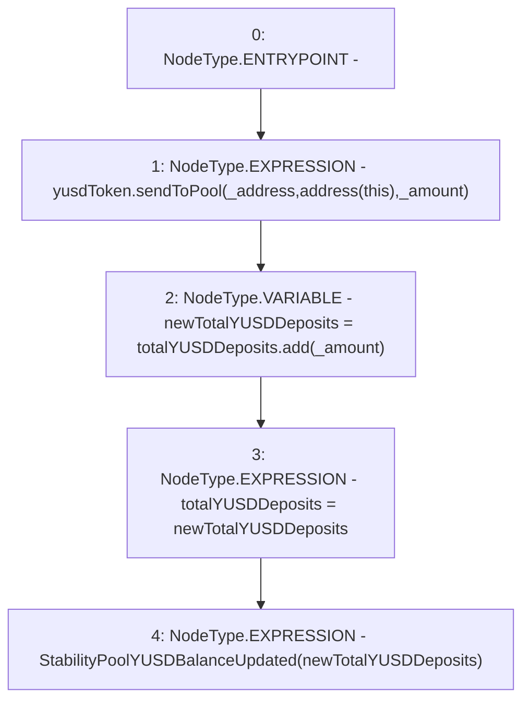

# Context: StabilityPool._sendYUSDtoStabilityPool

**Contract:** `StabilityPool` (Inherits: IStabilityPool, ICollateralReceiver, CheckContract, Ownable, LiquityBase, YetiCustomBase, BaseMath, ILiquityBase)
**Signature:** `_sendYUSDtoStabilityPool(address,uint256)`
**Method Selector ID:** `Internal (No Method ID)`
**Visibility:** `internal`
**Environment-Free:** `Yes`
**Modifiers:** None

### State Variables Interaction
- **Reads:** totalYUSDDeposits, yusdToken
- **Writes:** totalYUSDDeposits

### Environment & Verification Flags
- **Uses Foundry Cheatcodes:** No
- **Has Echidna Properties:** No

### Internal Calls Tree
- None

### External Calls / Value Transfers
- `IYUSDToken.HIGH_LEVEL_CALL, dest:yusdToken(IYUSDToken), function:sendToPool, arguments:['_address', 'TMP_570', '_amount']  `
- `SafeMath.TMP_572(uint256) = LIBRARY_CALL, dest:SafeMath, function:SafeMath.add(uint256,uint256), arguments:['totalYUSDDeposits', '_amount'] `

### Control Flow Graph (CFG)


### Source Mapping
Declared in: `certora-ac-datasets/detasets/web3bugs/dataset/web3bugs/66/packages/contracts/contracts/StabilityPool.sol` on lines **933** to **938**

```solidity
    function _sendYUSDtoStabilityPool(address _address, uint256 _amount) internal {
        yusdToken.sendToPool(_address, address(this), _amount);
        uint256 newTotalYUSDDeposits = totalYUSDDeposits.add(_amount);
        totalYUSDDeposits = newTotalYUSDDeposits;
        emit StabilityPoolYUSDBalanceUpdated(newTotalYUSDDeposits);
    }

```
