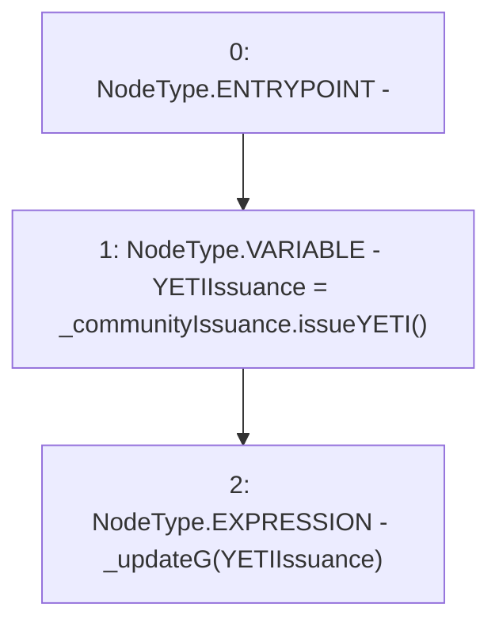

# Context: StabilityPool._triggerYETIIssuance

**Contract:** `StabilityPool` (Inherits: IStabilityPool, ICollateralReceiver, CheckContract, Ownable, LiquityBase, YetiCustomBase, BaseMath, ILiquityBase)
**Signature:** `_triggerYETIIssuance(ICommunityIssuance)`
**Method Selector ID:** `Internal (No Method ID)`
**Visibility:** `internal`
**Environment-Free:** `Yes`
**Modifiers:** None

### State Variables Interaction
- **Reads:** None
- **Writes:** None

### Environment & Verification Flags
- **Uses Foundry Cheatcodes:** No
- **Has Echidna Properties:** No

### Internal Calls Tree
- None

### External Calls / Value Transfers
- `ICommunityIssuance.TMP_441(uint256) = HIGH_LEVEL_CALL, dest:_communityIssuance(ICommunityIssuance), function:issueYETI, arguments:[]  `

### Control Flow Graph (CFG)


### Source Mapping
Declared in: `certora-ac-datasets/detasets/web3bugs/dataset/web3bugs/66/packages/contracts/contracts/StabilityPool.sol` on lines **463** to **466**

```solidity
    function _triggerYETIIssuance(ICommunityIssuance _communityIssuance) internal {
        uint256 YETIIssuance = _communityIssuance.issueYETI();
        _updateG(YETIIssuance);
    }

```
