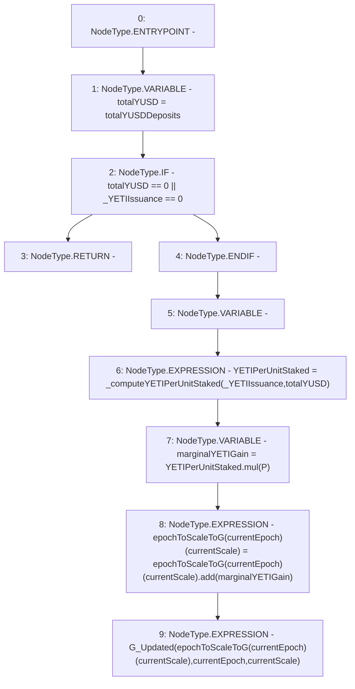

# Context: StabilityPool._updateG

**Contract:** `StabilityPool` (Inherits: IStabilityPool, ICollateralReceiver, CheckContract, Ownable, LiquityBase, YetiCustomBase, BaseMath, ILiquityBase)
**Signature:** `_updateG(uint256)`
**Method Selector ID:** `Internal (No Method ID)`
**Visibility:** `internal`
**Environment-Free:** `Yes`
**Modifiers:** None

### State Variables Interaction
- **Reads:** P, currentEpoch, currentScale, epochToScaleToG, totalYUSDDeposits
- **Writes:** epochToScaleToG

### Environment & Verification Flags
- **Uses Foundry Cheatcodes:** No
- **Has Echidna Properties:** No

### Internal Calls Tree
- None

### External Calls / Value Transfers
- `SafeMath.TMP_447(uint256) = LIBRARY_CALL, dest:SafeMath, function:SafeMath.mul(uint256,uint256), arguments:['YETIPerUnitStaked', 'P'] `
- `SafeMath.TMP_448(uint256) = LIBRARY_CALL, dest:SafeMath, function:SafeMath.add(uint256,uint256), arguments:['REF_445', 'marginalYETIGain'] `

### Control Flow Graph (CFG)


### Source Mapping
Declared in: `certora-ac-datasets/detasets/web3bugs/dataset/web3bugs/66/packages/contracts/contracts/StabilityPool.sol` on lines **468** to **487**

```solidity
    function _updateG(uint256 _YETIIssuance) internal {
        uint256 totalYUSD = totalYUSDDeposits; // cached to save an SLOAD
        /*
         * When total deposits is 0, G is not updated. In this case, the YETI issued can not be obtained by later
         * depositors - it is missed out on, and remains in the balanceof the CommunityIssuance contract.
         *
         */
        if (totalYUSD == 0 || _YETIIssuance == 0) {
            return;
        }

        uint256 YETIPerUnitStaked;
        YETIPerUnitStaked = _computeYETIPerUnitStaked(_YETIIssuance, totalYUSD);

        uint256 marginalYETIGain = YETIPerUnitStaked.mul(P);
        epochToScaleToG[currentEpoch][currentScale] = epochToScaleToG[currentEpoch][currentScale]
            .add(marginalYETIGain);

        emit G_Updated(epochToScaleToG[currentEpoch][currentScale], currentEpoch, currentScale);
    }

```
