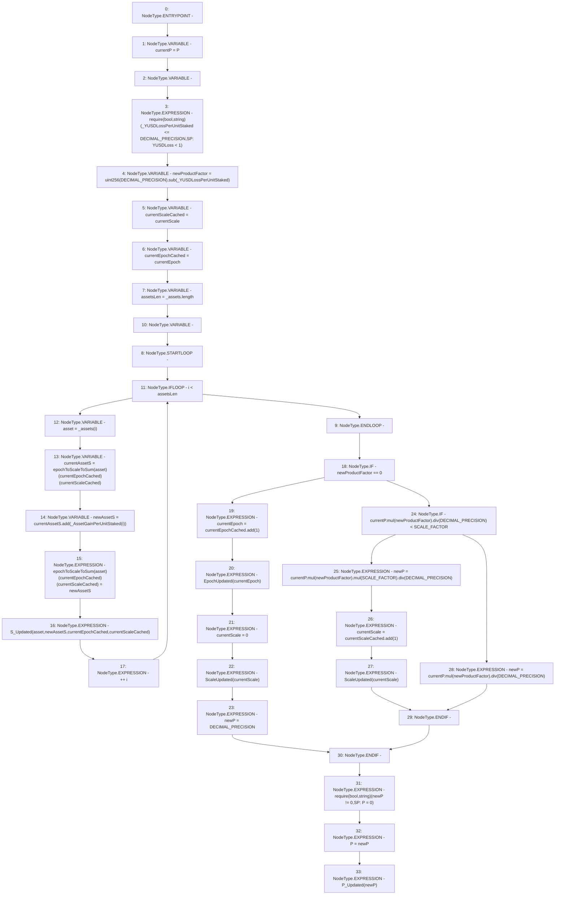

# Context: StabilityPool._updateRewardSumAndProduct

**Contract:** `StabilityPool` (Inherits: IStabilityPool, ICollateralReceiver, CheckContract, Ownable, LiquityBase, YetiCustomBase, BaseMath, ILiquityBase)
**Signature:** `_updateRewardSumAndProduct(address[],uint256[],uint256)`
**Method Selector ID:** `Internal (No Method ID)`
**Visibility:** `internal`
**Environment-Free:** `Yes`
**Modifiers:** None

### State Variables Interaction
- **Reads:** DECIMAL_PRECISION, P, SCALE_FACTOR, currentEpoch, currentScale, epochToScaleToSum
- **Writes:** P, currentEpoch, currentScale, epochToScaleToSum

### Assertion Checks & Business Requirements
- require/assert: `require(bool,string)(_YUSDLossPerUnitStaked <= DECIMAL_PRECISION,SP: YUSDLoss < 1)`
- require/assert: `require(bool,string)(newP != 0,SP: P = 0)`

### Environment & Verification Flags
- **Uses Foundry Cheatcodes:** No
- **Has Echidna Properties:** No

### Internal Calls Tree
- None

### External Calls / Value Transfers
- `LiquitySafeMath128.TMP_495(uint128) = LIBRARY_CALL, dest:LiquitySafeMath128, function:LiquitySafeMath128.add(uint128,uint128), arguments:['currentEpochCached', '1'] `
- `SafeMath.TMP_499(uint256) = LIBRARY_CALL, dest:SafeMath, function:SafeMath.div(uint256,uint256), arguments:['TMP_498', 'DECIMAL_PRECISION'] `
- `SafeMath.TMP_507(uint256) = LIBRARY_CALL, dest:SafeMath, function:SafeMath.div(uint256,uint256), arguments:['TMP_506', 'DECIMAL_PRECISION'] `
- `SafeMath.TMP_498(uint256) = LIBRARY_CALL, dest:SafeMath, function:SafeMath.mul(uint256,uint256), arguments:['currentP', 'newProductFactor'] `
- `SafeMath.TMP_502(uint256) = LIBRARY_CALL, dest:SafeMath, function:SafeMath.mul(uint256,uint256), arguments:['TMP_501', 'SCALE_FACTOR'] `
- `LiquitySafeMath128.TMP_504(uint128) = LIBRARY_CALL, dest:LiquitySafeMath128, function:LiquitySafeMath128.add(uint128,uint128), arguments:['currentScaleCached', '1'] `
- `SafeMath.TMP_501(uint256) = LIBRARY_CALL, dest:SafeMath, function:SafeMath.mul(uint256,uint256), arguments:['currentP', 'newProductFactor'] `
- `SafeMath.TMP_506(uint256) = LIBRARY_CALL, dest:SafeMath, function:SafeMath.mul(uint256,uint256), arguments:['currentP', 'newProductFactor'] `
- `SafeMath.TMP_492(uint256) = LIBRARY_CALL, dest:SafeMath, function:SafeMath.add(uint256,uint256), arguments:['currentAssetS', 'REF_488'] `
- `SafeMath.TMP_490(uint256) = LIBRARY_CALL, dest:SafeMath, function:SafeMath.sub(uint256,uint256), arguments:['TMP_489', '_YUSDLossPerUnitStaked'] `
- `SafeMath.TMP_503(uint256) = LIBRARY_CALL, dest:SafeMath, function:SafeMath.div(uint256,uint256), arguments:['TMP_502', 'DECIMAL_PRECISION'] `

### Control Flow Graph (CFG)


### Source Mapping
Declared in: `certora-ac-datasets/detasets/web3bugs/dataset/web3bugs/66/packages/contracts/contracts/StabilityPool.sol` on lines **605** to **662**

```solidity
    function _updateRewardSumAndProduct(
        address[] memory _assets,
        uint256[] memory _AssetGainPerUnitStaked,
        uint256 _YUSDLossPerUnitStaked
    ) internal {
        uint256 currentP = P;
        uint256 newP;

        require(_YUSDLossPerUnitStaked <= DECIMAL_PRECISION, "SP: YUSDLoss < 1");
        /*
         * The newProductFactor is the factor by which to change all deposits, due to the depletion of Stability Pool YUSD in the liquidation.
         * We make the product factor 0 if there was a pool-emptying. Otherwise, it is (1 - YUSDLossPerUnitStaked)
         */
        uint256 newProductFactor = uint256(DECIMAL_PRECISION).sub(_YUSDLossPerUnitStaked);

        uint128 currentScaleCached = currentScale;
        uint128 currentEpochCached = currentEpoch;

        /*
         * Calculate the new S first, before we update P.
         * The Collateral amount gain for any given depositor from a liquidation depends on the value of their deposit
         * (and the value of totalDeposits) prior to the Stability being depleted by the debt in the liquidation.
         *
         * Since S corresponds to Collateral amount gain, and P to deposit loss, we update S first.
         */
        uint256 assetsLen = _assets.length;
        for (uint256 i; i < assetsLen; ++i) {
            address asset = _assets[i];
            
            // uint256 marginalAssetGain = _AssetGainPerUnitStaked[i]; only used once, named here for clarity.
            uint256 currentAssetS = epochToScaleToSum[asset][currentEpochCached][currentScaleCached];
            uint256 newAssetS = currentAssetS.add(_AssetGainPerUnitStaked[i]);

            epochToScaleToSum[asset][currentEpochCached][currentScaleCached] = newAssetS;
            emit S_Updated(asset, newAssetS, currentEpochCached, currentScaleCached);
        }

        // If the Stability Pool was emptied, increment the epoch, and reset the scale and product P
        if (newProductFactor == 0) {
            currentEpoch = currentEpochCached.add(1);
            emit EpochUpdated(currentEpoch);
            currentScale = 0;
            emit ScaleUpdated(currentScale);
            newP = DECIMAL_PRECISION;

            // If multiplying P by a non-zero product factor would reduce P below the scale boundary, increment the scale
        } else if (currentP.mul(newProductFactor).div(DECIMAL_PRECISION) < SCALE_FACTOR) {
            newP = currentP.mul(newProductFactor).mul(SCALE_FACTOR).div(DECIMAL_PRECISION);
            currentScale = currentScaleCached.add(1);
            emit ScaleUpdated(currentScale);
        } else {
            newP = currentP.mul(newProductFactor).div(DECIMAL_PRECISION);
        }

        require(newP != 0, "SP: P = 0");
        P = newP;
        emit P_Updated(newP);
    }

```
