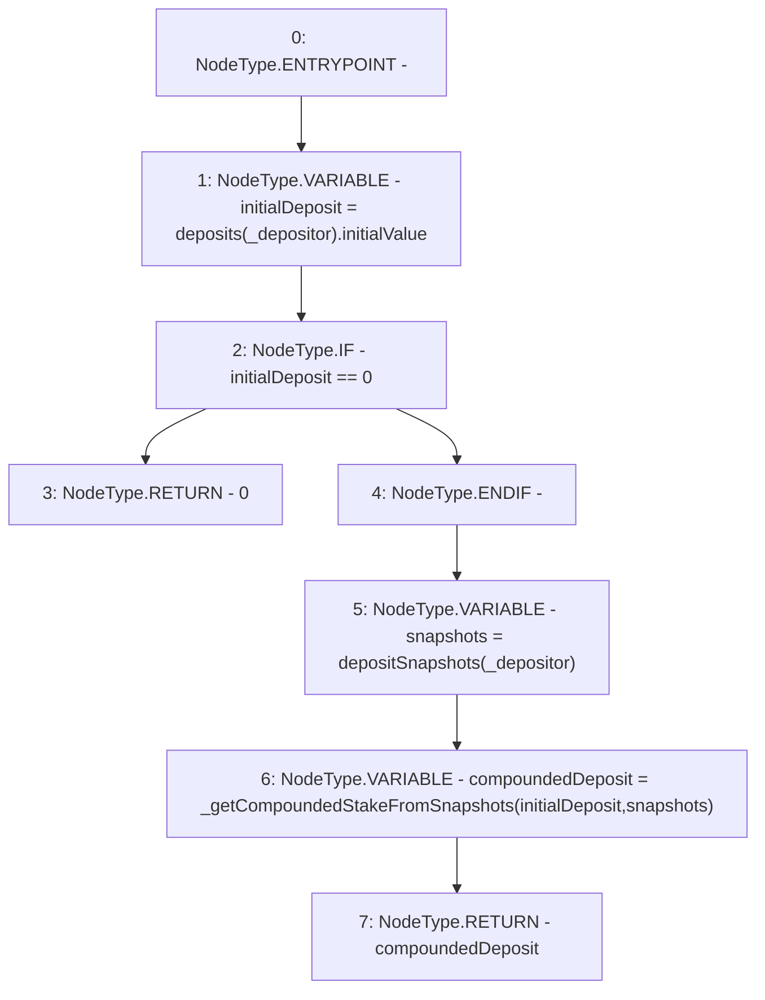

# Context: StabilityPool.getCompoundedYUSDDeposit

**Contract:** `StabilityPool` (Inherits: IStabilityPool, ICollateralReceiver, CheckContract, Ownable, LiquityBase, YetiCustomBase, BaseMath, ILiquityBase)
**Signature:** `getCompoundedYUSDDeposit(address) returns (uint256)`
**Method Selector ID:** `0x300a87c7`
**Visibility:** `public`
**Environment-Free:** `Yes`
**Modifiers:** None

### State Variables Interaction
- **Reads:** depositSnapshots, deposits
- **Writes:** None

### Environment & Verification Flags
- **Uses Foundry Cheatcodes:** No
- **Has Echidna Properties:** No

### Internal Calls Tree
- None

### External Calls / Value Transfers
- None

### Control Flow Graph (CFG)


### Source Mapping
Declared in: `certora-ac-datasets/detasets/web3bugs/dataset/web3bugs/66/packages/contracts/contracts/StabilityPool.sol` on lines **846** to **856**

```solidity
    function getCompoundedYUSDDeposit(address _depositor) public view override returns (uint256) {
        uint256 initialDeposit = deposits[_depositor].initialValue;
        if (initialDeposit == 0) {
            return 0;
        }

        Snapshots storage snapshots = depositSnapshots[_depositor];

        uint256 compoundedDeposit = _getCompoundedStakeFromSnapshots(initialDeposit, snapshots);
        return compoundedDeposit;
    }

```
