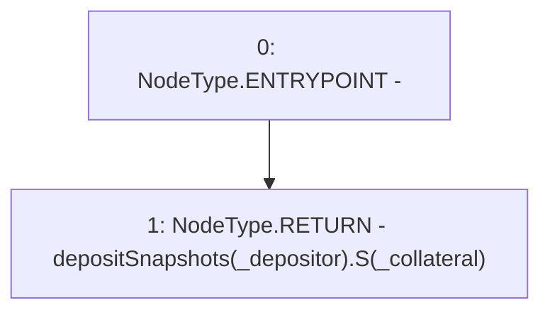

# Context: StabilityPool.getDepositSnapshotS

**Contract:** `StabilityPool` (Inherits: IStabilityPool, ICollateralReceiver, CheckContract, Ownable, LiquityBase, YetiCustomBase, BaseMath, ILiquityBase)
**Signature:** `getDepositSnapshotS(address,address) returns (uint256)`
**Method Selector ID:** `0xc5e1c9c3`
**Visibility:** `external`
**Environment-Free:** `Yes`
**Modifiers:** None

### State Variables Interaction
- **Reads:** depositSnapshots
- **Writes:** None

### Environment & Verification Flags
- **Uses Foundry Cheatcodes:** No
- **Has Echidna Properties:** No

### Internal Calls Tree
- None

### External Calls / Value Transfers
- None

### Control Flow Graph (CFG)


### Source Mapping
Declared in: `certora-ac-datasets/detasets/web3bugs/dataset/web3bugs/66/packages/contracts/contracts/StabilityPool.sol` on lines **1169** to **1176**

```solidity
    function getDepositSnapshotS(address _depositor, address _collateral)
        external
        view
        override
        returns (uint256)
    {
        return depositSnapshots[_depositor].S[_collateral];
    }

```
