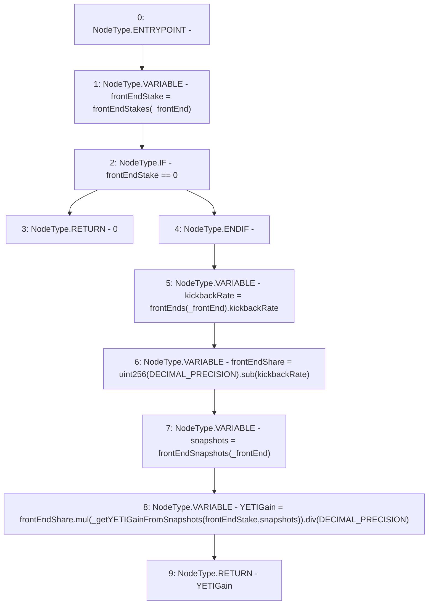

# Context: StabilityPool.getFrontEndYETIGain

**Contract:** `StabilityPool` (Inherits: IStabilityPool, ICollateralReceiver, CheckContract, Ownable, LiquityBase, YetiCustomBase, BaseMath, ILiquityBase)
**Signature:** `getFrontEndYETIGain(address) returns (uint256)`
**Method Selector ID:** `0xbc49b781`
**Visibility:** `public`
**Environment-Free:** `Yes`
**Modifiers:** None

### State Variables Interaction
- **Reads:** DECIMAL_PRECISION, frontEndSnapshots, frontEndStakes, frontEnds
- **Writes:** None

### Environment & Verification Flags
- **Uses Foundry Cheatcodes:** No
- **Has Echidna Properties:** No

### Internal Calls Tree
- None

### External Calls / Value Transfers
- `SafeMath.TMP_547(uint256) = LIBRARY_CALL, dest:SafeMath, function:SafeMath.div(uint256,uint256), arguments:['TMP_546', 'DECIMAL_PRECISION'] `
- `SafeMath.TMP_546(uint256) = LIBRARY_CALL, dest:SafeMath, function:SafeMath.mul(uint256,uint256), arguments:['frontEndShare', 'TMP_545'] `
- `SafeMath.TMP_544(uint256) = LIBRARY_CALL, dest:SafeMath, function:SafeMath.sub(uint256,uint256), arguments:['TMP_543', 'kickbackRate'] `

### Control Flow Graph (CFG)


### Source Mapping
Declared in: `certora-ac-datasets/detasets/web3bugs/dataset/web3bugs/66/packages/contracts/contracts/StabilityPool.sol` on lines **796** to **811**

```solidity
    function getFrontEndYETIGain(address _frontEnd) public view override returns (uint256) {
        uint256 frontEndStake = frontEndStakes[_frontEnd];
        if (frontEndStake == 0) {
            return 0;
        }

        uint256 kickbackRate = frontEnds[_frontEnd].kickbackRate;
        uint256 frontEndShare = uint256(DECIMAL_PRECISION).sub(kickbackRate);

        Snapshots storage snapshots = frontEndSnapshots[_frontEnd];

        uint256 YETIGain = frontEndShare
            .mul(_getYETIGainFromSnapshots(frontEndStake, snapshots))
            .div(DECIMAL_PRECISION);
        return YETIGain;
    }

```
