# Context: StabilityPool.provideToSP

**Contract:** `StabilityPool` (Inherits: IStabilityPool, ICollateralReceiver, CheckContract, Ownable, LiquityBase, YetiCustomBase, BaseMath, ILiquityBase)
**Signature:** `provideToSP(uint256,address)`
**Method Selector ID:** `0x5f788d65`
**Visibility:** `external`
**Environment-Free:** `No (reads EVM state context)`
**Modifiers:** None

### State Variables Interaction
- **Reads:** communityIssuance, deposits
- **Writes:** None

### Environment & Verification Flags
- **Uses Foundry Cheatcodes:** No
- **Has Echidna Properties:** No

### Internal Calls Tree
- None

### External Calls / Value Transfers
- `SafeMath.TMP_414(uint256) = LIBRARY_CALL, dest:SafeMath, function:SafeMath.add(uint256,uint256), arguments:['compoundedFrontEndStake', '_amount'] `
- `SafeMath.TMP_411(uint256) = LIBRARY_CALL, dest:SafeMath, function:SafeMath.sub(uint256,uint256), arguments:['initialDeposit', 'compoundedYUSDDeposit'] `
- `SafeMath.TMP_418(uint256) = LIBRARY_CALL, dest:SafeMath, function:SafeMath.add(uint256,uint256), arguments:['compoundedYUSDDeposit', '_amount'] `

### Control Flow Graph (CFG)

```mermaid
flowchart TD
    Node_0["0: NodeType.ENTRYPOINT - "]
    Node_0 --> Node_1
    Node_1["1: NodeType.EXPRESSION - _requireFrontEndIsRegisteredOrZero(_frontEndTag)"]
    Node_1 --> Node_2
    Node_2["2: NodeType.EXPRESSION - _requireFrontEndNotRegistered(msg.sender)"]
    Node_2 --> Node_3
    Node_3["3: NodeType.EXPRESSION - _requireNonZeroAmount(_amount)"]
    Node_3 --> Node_4
    Node_4["4: NodeType.VARIABLE - initialDeposit = deposits(msg.sender).initialValue"]
    Node_4 --> Node_5
    Node_5["5: NodeType.VARIABLE - communityIssuanceCached = communityIssuance"]
    Node_5 --> Node_6
    Node_6["6: NodeType.EXPRESSION - _triggerYETIIssuance(communityIssuanceCached)"]
    Node_6 --> Node_7
    Node_7["7: NodeType.IF - initialDeposit == 0"]
    Node_7 --> Node_8
    Node_7 --> Node_9
    Node_8["8: NodeType.EXPRESSION - _setFrontEndTag(msg.sender,_frontEndTag)"]
    Node_8 --> Node_9
    Node_9["9: NodeType.ENDIF - "]
    Node_9 --> Node_10
    Node_10["10: NodeType.VARIABLE - "]
    Node_10 --> Node_11
    Node_11["11: NodeType.VARIABLE - "]
    Node_11 --> Node_12
    Node_12["12: NodeType.EXPRESSION - (assets,amounts) = getDepositorGains(msg.sender)"]
    Node_12 --> Node_13
    Node_13["13: NodeType.VARIABLE - compoundedYUSDDeposit = getCompoundedYUSDDeposit(msg.sender)"]
    Node_13 --> Node_14
    Node_14["14: NodeType.VARIABLE - YUSDLoss = initialDeposit.sub(compoundedYUSDDeposit)"]
    Node_14 --> Node_15
    Node_15["15: NodeType.VARIABLE - frontEnd = deposits(msg.sender).frontEndTag"]
    Node_15 --> Node_16
    Node_16["16: NodeType.EXPRESSION - _payOutYETIGains(communityIssuanceCached,msg.sender,frontEnd)"]
    Node_16 --> Node_17
    Node_17["17: NodeType.VARIABLE - compoundedFrontEndStake = getCompoundedFrontEndStake(frontEnd)"]
    Node_17 --> Node_18
    Node_18["18: NodeType.VARIABLE - newFrontEndStake = compoundedFrontEndStake.add(_amount)"]
    Node_18 --> Node_19
    Node_19["19: NodeType.EXPRESSION - _updateFrontEndStakeAndSnapshots(frontEnd,newFrontEndStake)"]
    Node_19 --> Node_20
    Node_20["20: NodeType.EXPRESSION - FrontEndStakeChanged(frontEnd,newFrontEndStake,msg.sender)"]
    Node_20 --> Node_21
    Node_21["21: NodeType.EXPRESSION - _sendYUSDtoStabilityPool(msg.sender,_amount)"]
    Node_21 --> Node_22
    Node_22["22: NodeType.VARIABLE - newDeposit = compoundedYUSDDeposit.add(_amount)"]
    Node_22 --> Node_23
    Node_23["23: NodeType.EXPRESSION - _updateDepositAndSnapshots(msg.sender,newDeposit)"]
    Node_23 --> Node_24
    Node_24["24: NodeType.EXPRESSION - UserDepositChanged(msg.sender,newDeposit)"]
    Node_24 --> Node_25
    Node_25["25: NodeType.EXPRESSION - GainsWithdrawn(msg.sender,assets,amounts,YUSDLoss)"]
    Node_25 --> Node_26
    Node_26["26: NodeType.EXPRESSION - _sendGainsToDepositor(msg.sender,assets,amounts)"]
```


### Source Mapping
Declared in: `certora-ac-datasets/detasets/web3bugs/dataset/web3bugs/66/packages/contracts/contracts/StabilityPool.sol` on lines **370** to **409**

```solidity
    function provideToSP(uint256 _amount, address _frontEndTag) external override {
        _requireFrontEndIsRegisteredOrZero(_frontEndTag);
        _requireFrontEndNotRegistered(msg.sender);
        _requireNonZeroAmount(_amount);

        uint256 initialDeposit = deposits[msg.sender].initialValue;

        ICommunityIssuance communityIssuanceCached = communityIssuance;

        _triggerYETIIssuance(communityIssuanceCached);

        if (initialDeposit == 0) {
            _setFrontEndTag(msg.sender, _frontEndTag);
        }
        (address[] memory assets, uint256[] memory amounts) = getDepositorGains(msg.sender);
        uint256 compoundedYUSDDeposit = getCompoundedYUSDDeposit(msg.sender);
        uint256 YUSDLoss = initialDeposit.sub(compoundedYUSDDeposit); // Needed only for event log

        // First pay out any YETI gains
        address frontEnd = deposits[msg.sender].frontEndTag;
        _payOutYETIGains(communityIssuanceCached, msg.sender, frontEnd);

        // Update front end stake:
        uint256 compoundedFrontEndStake = getCompoundedFrontEndStake(frontEnd);
        uint256 newFrontEndStake = compoundedFrontEndStake.add(_amount);
        _updateFrontEndStakeAndSnapshots(frontEnd, newFrontEndStake);
        emit FrontEndStakeChanged(frontEnd, newFrontEndStake, msg.sender);

        // just pulls YUSD into the pool, updates totalYUSDDeposits variable for the stability pool
        // and throws an event
        _sendYUSDtoStabilityPool(msg.sender, _amount);

        uint256 newDeposit = compoundedYUSDDeposit.add(_amount);
        _updateDepositAndSnapshots(msg.sender, newDeposit);
        emit UserDepositChanged(msg.sender, newDeposit);

        emit GainsWithdrawn(msg.sender, assets, amounts, YUSDLoss); // YUSD Loss required for event log

        _sendGainsToDepositor(msg.sender, assets, amounts);
    }

```
