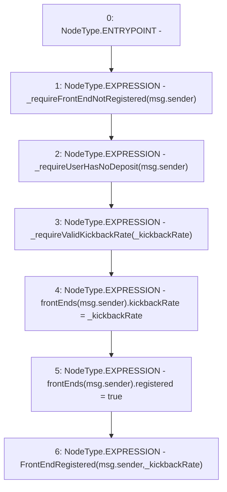

# Context: StabilityPool.registerFrontEnd

**Contract:** `StabilityPool` (Inherits: IStabilityPool, ICollateralReceiver, CheckContract, Ownable, LiquityBase, YetiCustomBase, BaseMath, ILiquityBase)
**Signature:** `registerFrontEnd(uint256)`
**Method Selector ID:** `0x556be101`
**Visibility:** `external`
**Environment-Free:** `No (reads EVM state context)`
**Modifiers:** None

### State Variables Interaction
- **Reads:** frontEnds
- **Writes:** frontEnds

### Environment & Verification Flags
- **Uses Foundry Cheatcodes:** No
- **Has Echidna Properties:** No

### Internal Calls Tree
- None

### External Calls / Value Transfers
- None

### Control Flow Graph (CFG)


### Source Mapping
Declared in: `certora-ac-datasets/detasets/web3bugs/dataset/web3bugs/66/packages/contracts/contracts/StabilityPool.sol` on lines **977** to **986**

```solidity
    function registerFrontEnd(uint256 _kickbackRate) external override {
        _requireFrontEndNotRegistered(msg.sender);
        _requireUserHasNoDeposit(msg.sender);
        _requireValidKickbackRate(_kickbackRate);

        frontEnds[msg.sender].kickbackRate = _kickbackRate;
        frontEnds[msg.sender].registered = true;

        emit FrontEndRegistered(msg.sender, _kickbackRate);
    }

```
