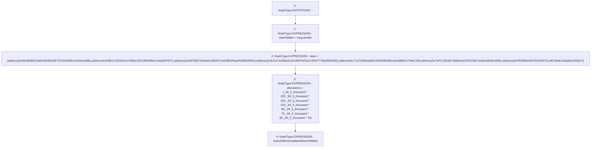

# Context: TeamAllocation.constructor

**Contract:** `TeamAllocation` (Inherits: None)
**Signature:** `constructor()`
**Method Selector ID:** `0x90fa17bb`
**Visibility:** `public`
**Environment-Free:** `No (reads EVM state context)`
**Modifiers:** None

### State Variables Interaction
- **Reads:** _94_5_thousand, teamWallet
- **Writes:** allocations, team, teamWallet

### Environment & Verification Flags
- **Uses Foundry Cheatcodes:** No
- **Has Echidna Properties:** No

### Internal Calls Tree
- None

### External Calls / Value Transfers
- None

### Control Flow Graph (CFG)


### Source Mapping
Declared in: `certora-ac-datasets/detasets/web3bugs/dataset/web3bugs/66/packages/contracts/contracts/TeamAllocation.sol` on lines **29** to **54**

```solidity
    constructor() public {

        teamWallet = msg.sender;

        team = [
        address(0x5Ed80B5C5e8A34D5E60572C022483Dc234Aea5Bb),
        address(0x02B11CdD34Ca73358c162C6B50f8eCe40a63F67F),
        address(0x95F58372A6e4b1B6D571e638E4f0aaFb4B0D895d),
        address(0xE4147a2B5bAc2D1B9FA23a1C0D477700Af590280),
        address(0x7Cd7D566ad0AD1903dfE680e4a1696814734eC28),
        address(0x7eFCCB1dE156b0ee337fD22567ae60c660dc265E),
        address(0xFB2B6fe35470CE08721cdfC84a61A6aa814262E7)
        ];

        allocations = [
        _94_5_thousand * 320,
        _94_5_thousand * 265,
        _94_5_thousand * 220,
        _94_5_thousand * 80,
        _94_5_thousand * 70,
        _94_5_thousand * 30,
        _94_5_thousand * 15
        ];

        emit teamAddressUpdated(teamWallet);
    }

```
