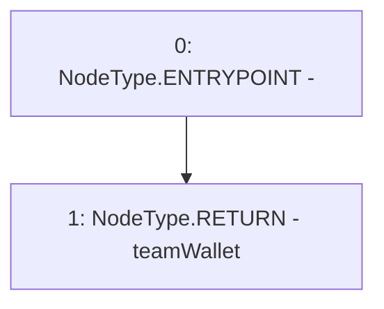

# Context: TeamAllocation.getTeamWallet

**Contract:** `TeamAllocation` (Inherits: None)
**Signature:** `getTeamWallet() returns (address)`
**Method Selector ID:** `0x0759a354`
**Visibility:** `external`
**Environment-Free:** `Yes`
**Modifiers:** None

### State Variables Interaction
- **Reads:** teamWallet
- **Writes:** None

### Environment & Verification Flags
- **Uses Foundry Cheatcodes:** No
- **Has Echidna Properties:** No

### Internal Calls Tree
- None

### External Calls / Value Transfers
- None

### Control Flow Graph (CFG)


### Source Mapping
Declared in: `certora-ac-datasets/detasets/web3bugs/dataset/web3bugs/66/packages/contracts/contracts/TeamAllocation.sol` on lines **94** to **96**

```solidity
    function getTeamWallet() external view returns (address) {
        return teamWallet;
    }

```
