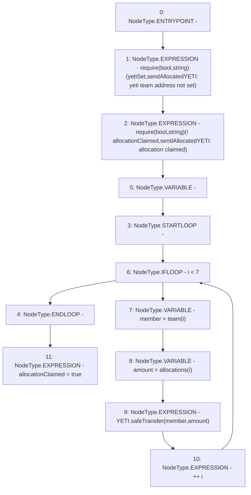

# Context: TeamAllocation.sendAllocatedYETI

**Contract:** `TeamAllocation` (Inherits: None)
**Signature:** `sendAllocatedYETI()`
**Method Selector ID:** `0x00971dcd`
**Visibility:** `external`
**Environment-Free:** `Yes`
**Modifiers:** None

### State Variables Interaction
- **Reads:** YETI, allocationClaimed, allocations, team, yetiSet
- **Writes:** allocationClaimed

### Assertion Checks & Business Requirements
- require/assert: `require(bool,string)(yetiSet,sendAllocatedYETI: yeti team address not set)`
- require/assert: `require(bool,string)(! allocationClaimed,sendAllocatedYETI: allocation claimed)`

### Environment & Verification Flags
- **Uses Foundry Cheatcodes:** No
- **Has Echidna Properties:** No

### Internal Calls Tree
- None

### External Calls / Value Transfers
- `TMP_74(None) = SOLIDITY_CALL require(bool,string)(yetiSet,sendAllocatedYETI: yeti team address not set)`
- `SafeERC20.LIBRARY_CALL, dest:SafeERC20, function:SafeERC20.safeTransfer(IERC20,address,uint256), arguments:['YETI', 'member', 'amount'] `
- `TMP_76(None) = SOLIDITY_CALL require(bool,string)(TMP_75,sendAllocatedYETI: allocation claimed)`

### Control Flow Graph (CFG)


### Source Mapping
Declared in: `certora-ac-datasets/detasets/web3bugs/dataset/web3bugs/66/packages/contracts/contracts/TeamAllocation.sol` on lines **69** to **78**

```solidity
    function sendAllocatedYETI() external {
        require(yetiSet, "sendAllocatedYETI: yeti team address not set");
        require(!allocationClaimed, "sendAllocatedYETI: allocation claimed");
        for (uint256 i; i < 7; ++i) {
            address member = team[i];
            uint amount = allocations[i];
            YETI.safeTransfer(member, amount);
        }
        allocationClaimed = true;
    }

```
