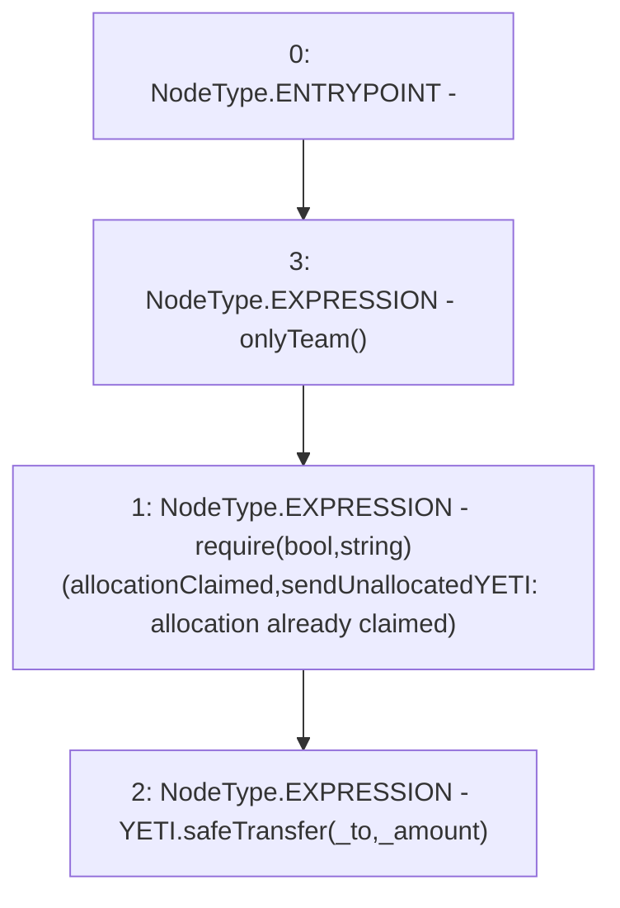

# Context: TeamAllocation.sendUnallocatedYETI

**Contract:** `TeamAllocation` (Inherits: None)
**Signature:** `sendUnallocatedYETI(address,uint256)`
**Method Selector ID:** `0xe05faf07`
**Visibility:** `external`
**Environment-Free:** `No (reads EVM state context)`
**Modifiers:**
- `onlyTeam`
  ```solidity
  modifier onlyTeam() {
          require(msg.sender == teamWallet, "Not a team wallet");
          _;
      }
  ```

### State Variables Interaction
- **Reads:** YETI, allocationClaimed
- **Writes:** None

### Assertion Checks & Business Requirements
- require/assert: `require(bool,string)(allocationClaimed,sendUnallocatedYETI: allocation already claimed)`

### Environment & Verification Flags
- **Uses Foundry Cheatcodes:** No
- **Has Echidna Properties:** No

### Internal Calls Tree
- None

### External Calls / Value Transfers
- `SafeERC20.LIBRARY_CALL, dest:SafeERC20, function:SafeERC20.safeTransfer(IERC20,address,uint256), arguments:['YETI', '_to', '_amount'] `
- `TMP_79(None) = SOLIDITY_CALL require(bool,string)(allocationClaimed,sendUnallocatedYETI: allocation already claimed)`

### Control Flow Graph (CFG)


### Source Mapping
Declared in: `certora-ac-datasets/detasets/web3bugs/dataset/web3bugs/66/packages/contracts/contracts/TeamAllocation.sol` on lines **81** to **84**

```solidity
    function sendUnallocatedYETI(address _to, uint _amount) external onlyTeam {
        require(allocationClaimed, "sendUnallocatedYETI: allocation already claimed");
        YETI.safeTransfer(_to, _amount);
    }

```
