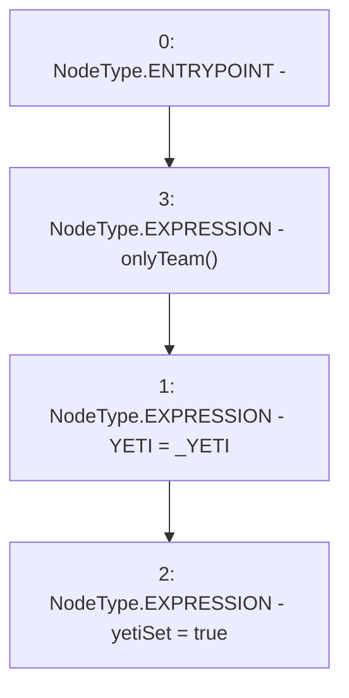

# Context: TeamAllocation.setYetiAddress

**Contract:** `TeamAllocation` (Inherits: None)
**Signature:** `setYetiAddress(IERC20)`
**Method Selector ID:** `0x502f1b63`
**Visibility:** `external`
**Environment-Free:** `No (reads EVM state context)`
**Modifiers:**
- `onlyTeam`
  ```solidity
  modifier onlyTeam() {
          require(msg.sender == teamWallet, "Not a team wallet");
          _;
      }
  ```

### State Variables Interaction
- **Reads:** None
- **Writes:** YETI, yetiSet

### Environment & Verification Flags
- **Uses Foundry Cheatcodes:** No
- **Has Echidna Properties:** No

### Internal Calls Tree
- None

### External Calls / Value Transfers
- None

### Control Flow Graph (CFG)


### Source Mapping
Declared in: `certora-ac-datasets/detasets/web3bugs/dataset/web3bugs/66/packages/contracts/contracts/TeamAllocation.sol` on lines **63** to **66**

```solidity
    function setYetiAddress(IERC20 _YETI) external onlyTeam {
        YETI = _YETI;
        yetiSet = true;
    }

```
