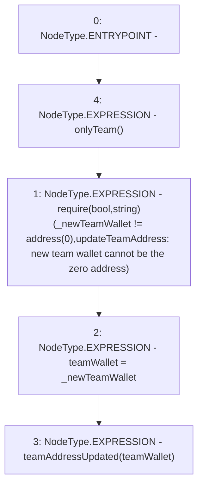

# Context: TeamAllocation.updateTeamAddress

**Contract:** `TeamAllocation` (Inherits: None)
**Signature:** `updateTeamAddress(address)`
**Method Selector ID:** `0x14eb76ac`
**Visibility:** `external`
**Environment-Free:** `No (reads EVM state context)`
**Modifiers:**
- `onlyTeam`
  ```solidity
  modifier onlyTeam() {
          require(msg.sender == teamWallet, "Not a team wallet");
          _;
      }
  ```

### State Variables Interaction
- **Reads:** teamWallet
- **Writes:** teamWallet

### Assertion Checks & Business Requirements
- require/assert: `require(bool,string)(_newTeamWallet != address(0),updateTeamAddress: new team wallet cannot be the zero address)`

### Environment & Verification Flags
- **Uses Foundry Cheatcodes:** No
- **Has Echidna Properties:** No

### Internal Calls Tree
- None

### External Calls / Value Transfers
- None

### Control Flow Graph (CFG)


### Source Mapping
Declared in: `certora-ac-datasets/detasets/web3bugs/dataset/web3bugs/66/packages/contracts/contracts/TeamAllocation.sol` on lines **87** to **91**

```solidity
    function updateTeamAddress(address _newTeamWallet) external onlyTeam {
        require(_newTeamWallet != address(0), "updateTeamAddress: new team wallet cannot be the zero address");
        teamWallet = _newTeamWallet;
        emit teamAddressUpdated(teamWallet);
    }

```
