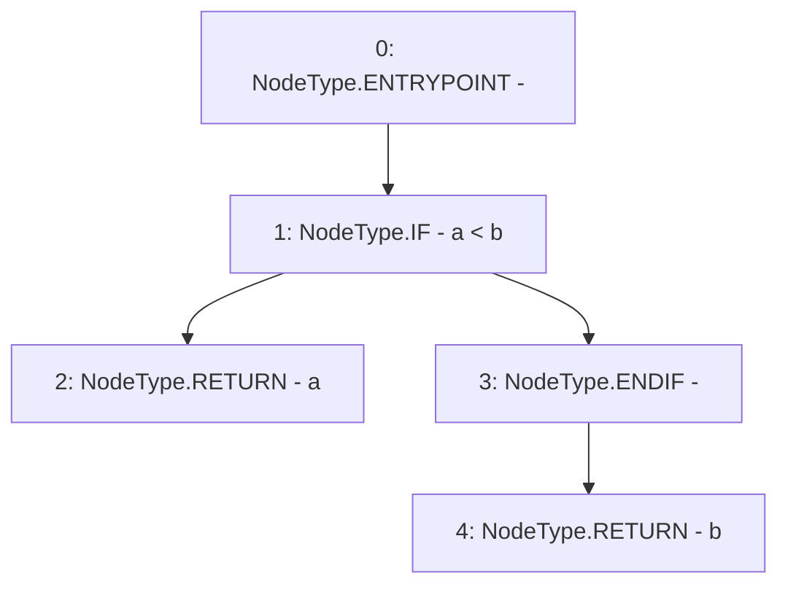

# Context: TeamLockup._min

**Contract:** `TeamLockup` (Inherits: None)
**Signature:** `_min(uint256,uint256) returns (uint256)`
**Method Selector ID:** `Internal (No Method ID)`
**Visibility:** `internal`
**Environment-Free:** `Yes`
**Modifiers:** None

### State Variables Interaction
- **Reads:** None
- **Writes:** None

### Environment & Verification Flags
- **Uses Foundry Cheatcodes:** No
- **Has Echidna Properties:** No

### Internal Calls Tree
- None

### External Calls / Value Transfers
- None

### Control Flow Graph (CFG)


### Source Mapping
Declared in: `certora-ac-datasets/detasets/web3bugs/dataset/web3bugs/66/packages/contracts/contracts/YETI/TeamLockup.sol` on lines **57** to **62**

```solidity
    function _min(uint a, uint b) internal pure returns (uint) {
        if (a < b) {
            return a;
        }
        return b;
    }

```
