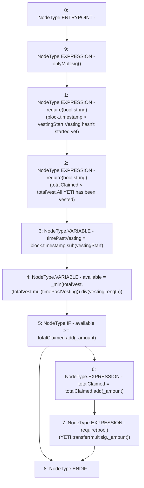

# Context: TeamLockup.claimYeti

**Contract:** `TeamLockup` (Inherits: None)
**Signature:** `claimYeti(uint256)`
**Method Selector ID:** `0xeb2752a1`
**Visibility:** `external`
**Environment-Free:** `No (reads EVM state context)`
**Modifiers:**
- `onlyMultisig`
  ```solidity
  modifier onlyMultisig {
          require(
              msg.sender == multisig,
              "Only the multisig can call this function."
          );
          _;
      }
  ```

### State Variables Interaction
- **Reads:** YETI, multisig, totalClaimed, totalVest, vestingLength, vestingStart
- **Writes:** totalClaimed

### Assertion Checks & Business Requirements
- require/assert: `require(bool,string)(block.timestamp > vestingStart,Vesting hasn't started yet)`
- require/assert: `require(bool,string)(totalClaimed < totalVest,All YETI has been vested)`
- require/assert: `require(bool)(YETI.transfer(multisig,_amount))`

### Environment & Verification Flags
- **Uses Foundry Cheatcodes:** No
- **Has Echidna Properties:** No

### Internal Calls Tree
- None

### External Calls / Value Transfers
- `IERC20.TMP_31(bool) = HIGH_LEVEL_CALL, dest:YETI(IERC20), function:transfer, arguments:['multisig', '_amount']  `
- `SafeMath.TMP_30(uint256) = LIBRARY_CALL, dest:SafeMath, function:SafeMath.add(uint256,uint256), arguments:['totalClaimed', '_amount'] `
- `SafeMath.TMP_24(uint256) = LIBRARY_CALL, dest:SafeMath, function:SafeMath.sub(uint256,uint256), arguments:['block.timestamp', 'vestingStart'] `
- `SafeMath.TMP_28(uint256) = LIBRARY_CALL, dest:SafeMath, function:SafeMath.add(uint256,uint256), arguments:['totalClaimed', '_amount'] `
- `SafeMath.TMP_25(uint256) = LIBRARY_CALL, dest:SafeMath, function:SafeMath.mul(uint256,uint256), arguments:['totalVest', 'timePastVesting'] `
- `SafeMath.TMP_26(uint256) = LIBRARY_CALL, dest:SafeMath, function:SafeMath.div(uint256,uint256), arguments:['TMP_25', 'vestingLength'] `

### Control Flow Graph (CFG)


### Source Mapping
Declared in: `certora-ac-datasets/detasets/web3bugs/dataset/web3bugs/66/packages/contracts/contracts/YETI/TeamLockup.sol` on lines **37** to **49**

```solidity
    function claimYeti(uint _amount) external onlyMultisig {
        require(block.timestamp > vestingStart, "Vesting hasn't started yet");
        require(totalClaimed < totalVest, "All YETI has been vested");

        uint timePastVesting = block.timestamp.sub(vestingStart);

        uint available = _min(totalVest,(totalVest.mul(timePastVesting)).div(vestingLength));
        if (available >= totalClaimed.add(_amount)) {
            // there are _amount YETI tokens that are claimable
            totalClaimed = totalClaimed.add(_amount);
            require(YETI.transfer(multisig, _amount));
        }
    }

```
