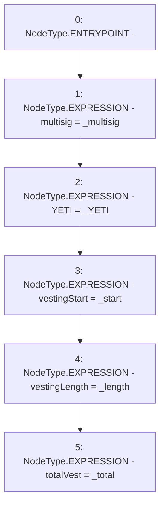

# Context: TeamLockup.constructor

**Contract:** `TeamLockup` (Inherits: None)
**Signature:** `constructor(address,IERC20,uint256,uint256,uint256)`
**Method Selector ID:** `0x34c68697`
**Visibility:** `public`
**Environment-Free:** `Yes`
**Modifiers:** None

### State Variables Interaction
- **Reads:** None
- **Writes:** YETI, multisig, totalVest, vestingLength, vestingStart

### Environment & Verification Flags
- **Uses Foundry Cheatcodes:** No
- **Has Echidna Properties:** No

### Internal Calls Tree
- None

### External Calls / Value Transfers
- None

### Control Flow Graph (CFG)


### Source Mapping
Declared in: `certora-ac-datasets/detasets/web3bugs/dataset/web3bugs/66/packages/contracts/contracts/YETI/TeamLockup.sol` on lines **27** to **34**

```solidity
    constructor(address _multisig, IERC20 _YETI, uint _start, uint _length, uint _total) public {
        multisig = _multisig;
        YETI = _YETI;

        vestingStart = _start;
        vestingLength = _length;
        totalVest = _total;
    }

```
