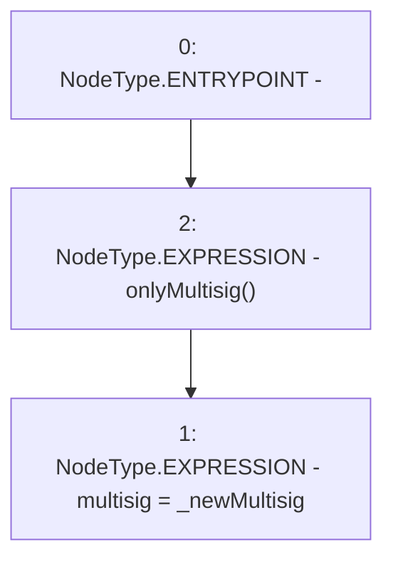

# Context: TeamLockup.updateMultisig

**Contract:** `TeamLockup` (Inherits: None)
**Signature:** `updateMultisig(address)`
**Method Selector ID:** `0x2929c25c`
**Visibility:** `external`
**Environment-Free:** `No (reads EVM state context)`
**Modifiers:**
- `onlyMultisig`
  ```solidity
  modifier onlyMultisig {
          require(
              msg.sender == multisig,
              "Only the multisig can call this function."
          );
          _;
      }
  ```

### State Variables Interaction
- **Reads:** None
- **Writes:** multisig

### Environment & Verification Flags
- **Uses Foundry Cheatcodes:** No
- **Has Echidna Properties:** No

### Internal Calls Tree
- None

### External Calls / Value Transfers
- None

### Control Flow Graph (CFG)


### Source Mapping
Declared in: `certora-ac-datasets/detasets/web3bugs/dataset/web3bugs/66/packages/contracts/contracts/YETI/TeamLockup.sol` on lines **52** to **54**

```solidity
    function updateMultisig(address _newMultisig) external onlyMultisig {
        multisig = _newMultisig;
    }

```
