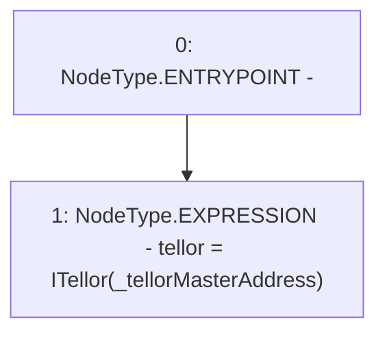

# Context: TellorCaller.constructor

**Contract:** `TellorCaller` (Inherits: ITellorCaller)
**Signature:** `constructor(address)`
**Method Selector ID:** `0xf8a6c595`
**Visibility:** `public`
**Environment-Free:** `Yes`
**Modifiers:** None

### State Variables Interaction
- **Reads:** None
- **Writes:** tellor

### Environment & Verification Flags
- **Uses Foundry Cheatcodes:** No
- **Has Echidna Properties:** No

### Internal Calls Tree
- None

### External Calls / Value Transfers
- None

### Control Flow Graph (CFG)


### Source Mapping
Declared in: `certora-ac-datasets/detasets/web3bugs/dataset/web3bugs/66/packages/contracts/contracts/Dependencies/TellorCaller.sol` on lines **23** to **25**

```solidity
    constructor (address _tellorMasterAddress) public {
        tellor = ITellor(_tellorMasterAddress);
    }

```
