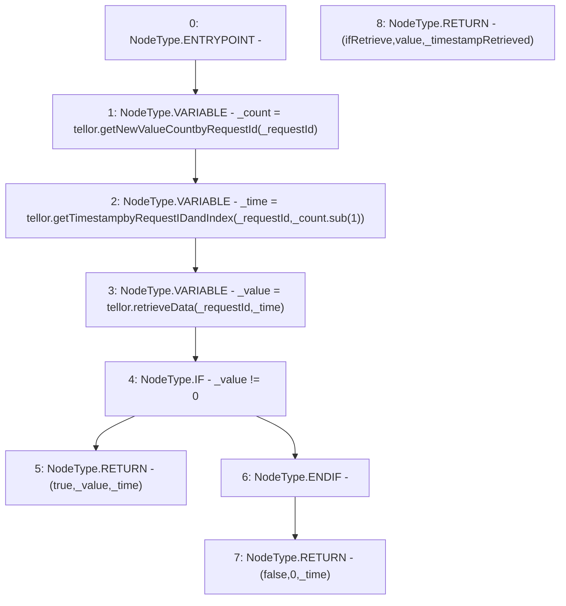

# Context: TellorCaller.getTellorCurrentValue

**Contract:** `TellorCaller` (Inherits: ITellorCaller)
**Signature:** `getTellorCurrentValue(uint256) returns (bool, uint256, uint256)`
**Method Selector ID:** `0x32e6aadb`
**Visibility:** `external`
**Environment-Free:** `Yes`
**Modifiers:** None

### State Variables Interaction
- **Reads:** tellor
- **Writes:** None

### Environment & Verification Flags
- **Uses Foundry Cheatcodes:** No
- **Has Echidna Properties:** No

### Internal Calls Tree
- None

### External Calls / Value Transfers
- `SafeMath.TMP_22(uint256) = LIBRARY_CALL, dest:SafeMath, function:SafeMath.sub(uint256,uint256), arguments:['_count', '1'] `
- `ITellor.TMP_23(uint256) = HIGH_LEVEL_CALL, dest:tellor(ITellor), function:getTimestampbyRequestIDandIndex, arguments:['_requestId', 'TMP_22']  `
- `ITellor.TMP_21(uint256) = HIGH_LEVEL_CALL, dest:tellor(ITellor), function:getNewValueCountbyRequestId, arguments:['_requestId']  `
- `ITellor.TMP_24(uint256) = HIGH_LEVEL_CALL, dest:tellor(ITellor), function:retrieveData, arguments:['_requestId', '_time']  `

### Control Flow Graph (CFG)


### Source Mapping
Declared in: `certora-ac-datasets/detasets/web3bugs/dataset/web3bugs/66/packages/contracts/contracts/Dependencies/TellorCaller.sol` on lines **36** to **52**

```solidity
    function getTellorCurrentValue(uint256 _requestId)
        external
        view
        override
        returns (
            bool ifRetrieve,
            uint256 value,
            uint256 _timestampRetrieved
        )
    {
        uint256 _count = tellor.getNewValueCountbyRequestId(_requestId);
        uint256 _time =
            tellor.getTimestampbyRequestIDandIndex(_requestId, _count.sub(1));
        uint256 _value = tellor.retrieveData(_requestId, _time);
        if (_value != 0) return (true, _value, _time);
        return (false, 0, _time);
    }

```
