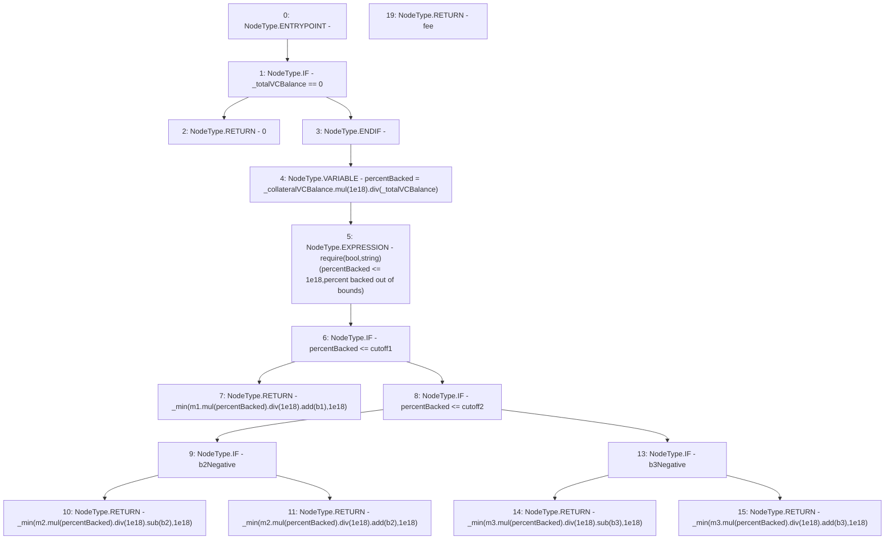

# Context: ThreePieceWiseLinearPriceCurve._getFeePoint

**Contract:** `ThreePieceWiseLinearPriceCurve` (Inherits: Ownable, IPriceCurve)
**Signature:** `_getFeePoint(uint256,uint256) returns (uint256)`
**Method Selector ID:** `Internal (No Method ID)`
**Visibility:** `internal`
**Environment-Free:** `Yes`
**Modifiers:** None

### State Variables Interaction
- **Reads:** b1, b2, b2Negative, b3, b3Negative, cutoff1, cutoff2, m1, m2, m3
- **Writes:** None

### Assertion Checks & Business Requirements
- require/assert: `require(bool,string)(percentBacked <= 1e18,percent backed out of bounds)`

### Environment & Verification Flags
- **Uses Foundry Cheatcodes:** No
- **Has Echidna Properties:** No

### Internal Calls Tree
- None

### External Calls / Value Transfers
- `SafeMath.TMP_106(uint256) = LIBRARY_CALL, dest:SafeMath, function:SafeMath.mul(uint256,uint256), arguments:['m3', 'percentBacked'] `
- `SafeMath.TMP_95(uint256) = LIBRARY_CALL, dest:SafeMath, function:SafeMath.div(uint256,uint256), arguments:['TMP_94', '1000000000000000000'] `
- `SafeMath.TMP_102(uint256) = LIBRARY_CALL, dest:SafeMath, function:SafeMath.mul(uint256,uint256), arguments:['m3', 'percentBacked'] `
- `SafeMath.TMP_104(uint256) = LIBRARY_CALL, dest:SafeMath, function:SafeMath.sub(uint256,uint256), arguments:['TMP_103', 'b3'] `
- `SafeMath.TMP_96(uint256) = LIBRARY_CALL, dest:SafeMath, function:SafeMath.sub(uint256,uint256), arguments:['TMP_95', 'b2'] `
- `SafeMath.TMP_84(uint256) = LIBRARY_CALL, dest:SafeMath, function:SafeMath.mul(uint256,uint256), arguments:['_collateralVCBalance', '1000000000000000000'] `
- `SafeMath.TMP_90(uint256) = LIBRARY_CALL, dest:SafeMath, function:SafeMath.div(uint256,uint256), arguments:['TMP_89', '1000000000000000000'] `
- `SafeMath.TMP_85(uint256) = LIBRARY_CALL, dest:SafeMath, function:SafeMath.div(uint256,uint256), arguments:['TMP_84', '_totalVCBalance'] `
- `SafeMath.TMP_94(uint256) = LIBRARY_CALL, dest:SafeMath, function:SafeMath.mul(uint256,uint256), arguments:['m2', 'percentBacked'] `
- `SafeMath.TMP_91(uint256) = LIBRARY_CALL, dest:SafeMath, function:SafeMath.add(uint256,uint256), arguments:['TMP_90', 'b1'] `
- `SafeMath.TMP_103(uint256) = LIBRARY_CALL, dest:SafeMath, function:SafeMath.div(uint256,uint256), arguments:['TMP_102', '1000000000000000000'] `
- `SafeMath.TMP_99(uint256) = LIBRARY_CALL, dest:SafeMath, function:SafeMath.div(uint256,uint256), arguments:['TMP_98', '1000000000000000000'] `
- `SafeMath.TMP_98(uint256) = LIBRARY_CALL, dest:SafeMath, function:SafeMath.mul(uint256,uint256), arguments:['m2', 'percentBacked'] `
- `SafeMath.TMP_89(uint256) = LIBRARY_CALL, dest:SafeMath, function:SafeMath.mul(uint256,uint256), arguments:['m1', 'percentBacked'] `
- `SafeMath.TMP_108(uint256) = LIBRARY_CALL, dest:SafeMath, function:SafeMath.add(uint256,uint256), arguments:['TMP_107', 'b3'] `
- `SafeMath.TMP_100(uint256) = LIBRARY_CALL, dest:SafeMath, function:SafeMath.add(uint256,uint256), arguments:['TMP_99', 'b2'] `
- `SafeMath.TMP_107(uint256) = LIBRARY_CALL, dest:SafeMath, function:SafeMath.div(uint256,uint256), arguments:['TMP_106', '1000000000000000000'] `

### Control Flow Graph (CFG)


### Source Mapping
Declared in: `certora-ac-datasets/detasets/web3bugs/dataset/web3bugs/66/packages/contracts/contracts/PriceCurves/ThreePieceWiseLinearPriceCurve.sol` on lines **149** to **174**

```solidity
    function _getFeePoint(uint256 _collateralVCBalance, uint256 _totalVCBalance) internal view returns (uint256 fee) {
        if (_totalVCBalance == 0) {
            return 0;
        }
        // percent of all VC backed by this collateral * 1e18
        uint256 percentBacked = _collateralVCBalance.mul(1e18).div(_totalVCBalance);
        require(percentBacked <= 1e18, "percent backed out of bounds");

        if (percentBacked <= cutoff1) { // use function 1
            return _min(m1.mul(percentBacked).div(1e18).add(b1), 1e18);
        } else if (percentBacked <= cutoff2) { // use function 2
            if (b2Negative) {
                return _min(m2.mul(percentBacked).div(1e18).sub(b2), 1e18);
            } else {
                return _min(m2.mul(percentBacked).div(1e18).add(b2), 1e18);
            }
            // return _min(m2.mul(percentBacked).div(1e18).add(b2), 1e18);
        } else { // use function 3
            if (b3Negative) {
                return _min(m3.mul(percentBacked).div(1e18).sub(b3), 1e18);
            } else {
                return _min(m3.mul(percentBacked).div(1e18).add(b3), 1e18);
            }
            // return _min(m3.mul(percentBacked).div(1e18).add(b3), 1e18);
        }
    }

```
