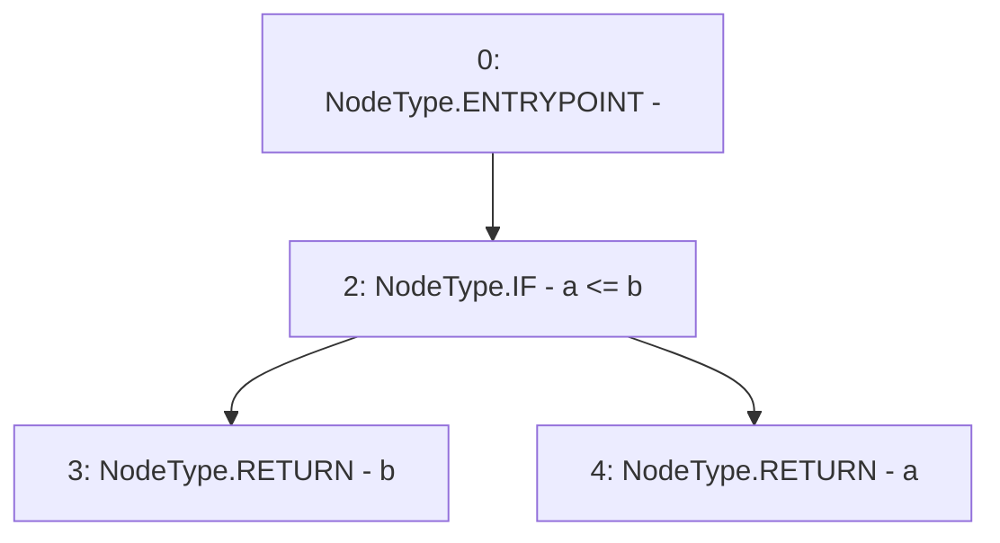

# Context: ThreePieceWiseLinearPriceCurve._max

**Contract:** `ThreePieceWiseLinearPriceCurve` (Inherits: Ownable, IPriceCurve)
**Signature:** `_max(uint256,uint256) returns (uint256)`
**Method Selector ID:** `Internal (No Method ID)`
**Visibility:** `internal`
**Environment-Free:** `Yes`
**Modifiers:** None

### State Variables Interaction
- **Reads:** None
- **Writes:** None

### Environment & Verification Flags
- **Uses Foundry Cheatcodes:** No
- **Has Echidna Properties:** No

### Internal Calls Tree
- None

### External Calls / Value Transfers
- None

### Control Flow Graph (CFG)


### Source Mapping
Declared in: `certora-ac-datasets/detasets/web3bugs/dataset/web3bugs/66/packages/contracts/contracts/PriceCurves/ThreePieceWiseLinearPriceCurve.sol` on lines **192** to **194**

```solidity
    function _max(uint256 a, uint256 b) internal pure returns (uint256) {
        return a <= b ? b : a;
    }

```
