# Context: ThreePieceWiseLinearPriceCurve.adjustParams

**Contract:** `ThreePieceWiseLinearPriceCurve` (Inherits: Ownable, IPriceCurve)
**Signature:** `adjustParams(string,uint256,uint256,uint256,uint256,uint256,uint256,uint256)`
**Method Selector ID:** `0x1d095ae8`
**Visibility:** `external`
**Environment-Free:** `No (reads EVM state context)`
**Modifiers:**
- `onlyOwner`
  ```solidity
  modifier onlyOwner() {
          require(isOwner(), "CallerNotOwner");
          _;
      }
  ```

### State Variables Interaction
- **Reads:** b2
- **Writes:** b1, b2, b2Negative, b3, b3Negative, cutoff1, cutoff2, decayTime, dollarCap, m1, m2, m3, name

### Assertion Checks & Business Requirements
- require/assert: `require(bool,string)(_cutoff1 <= _cutoff2,Cutoffs must be increasing)`

### Environment & Verification Flags
- **Uses Foundry Cheatcodes:** No
- **Has Echidna Properties:** No

### Internal Calls Tree
- None

### External Calls / Value Transfers
- `SafeMath.TMP_39(uint256) = LIBRARY_CALL, dest:SafeMath, function:SafeMath.mul(uint256,uint256), arguments:['_m2', '_cutoff1'] `
- `SafeMath.TMP_48(uint256) = LIBRARY_CALL, dest:SafeMath, function:SafeMath.div(uint256,uint256), arguments:['TMP_47', '1000000000000000000'] `
- `SafeMath.TMP_50(uint256) = LIBRARY_CALL, dest:SafeMath, function:SafeMath.sub(uint256,uint256), arguments:['m3Val', 'm2Val'] `
- `SafeMath.TMP_37(uint256) = LIBRARY_CALL, dest:SafeMath, function:SafeMath.div(uint256,uint256), arguments:['TMP_36', '1000000000000000000'] `
- `SafeMath.TMP_38(uint256) = LIBRARY_CALL, dest:SafeMath, function:SafeMath.add(uint256,uint256), arguments:['TMP_37', '_b1'] `
- `SafeMath.TMP_36(uint256) = LIBRARY_CALL, dest:SafeMath, function:SafeMath.mul(uint256,uint256), arguments:['_m1', '_cutoff1'] `
- `SafeMath.TMP_51(uint256) = LIBRARY_CALL, dest:SafeMath, function:SafeMath.sub(uint256,uint256), arguments:['m2Val', 'm3Val'] `
- `SafeMath.TMP_46(uint256) = LIBRARY_CALL, dest:SafeMath, function:SafeMath.add(uint256,uint256), arguments:['TMP_45', 'b2'] `
- `SafeMath.TMP_40(uint256) = LIBRARY_CALL, dest:SafeMath, function:SafeMath.div(uint256,uint256), arguments:['TMP_39', '1000000000000000000'] `
- `SafeMath.TMP_45(uint256) = LIBRARY_CALL, dest:SafeMath, function:SafeMath.div(uint256,uint256), arguments:['TMP_44', '1000000000000000000'] `
- `SafeMath.TMP_42(uint256) = LIBRARY_CALL, dest:SafeMath, function:SafeMath.sub(uint256,uint256), arguments:['m2Val', 'm1Val'] `
- `SafeMath.TMP_43(uint256) = LIBRARY_CALL, dest:SafeMath, function:SafeMath.sub(uint256,uint256), arguments:['m1Val', 'm2Val'] `
- `SafeMath.TMP_47(uint256) = LIBRARY_CALL, dest:SafeMath, function:SafeMath.mul(uint256,uint256), arguments:['_m3', '_cutoff2'] `
- `SafeMath.TMP_44(uint256) = LIBRARY_CALL, dest:SafeMath, function:SafeMath.mul(uint256,uint256), arguments:['_m2', '_cutoff2'] `

### Control Flow Graph (CFG)

```mermaid
flowchart TD
    Node_0["0: NodeType.ENTRYPOINT - "]
    Node_0 --> Node_25
    Node_1["1: NodeType.EXPRESSION - require(bool,string)(_cutoff1 <= _cutoff2,Cutoffs must be increasing)"]
    Node_1 --> Node_2
    Node_2["2: NodeType.EXPRESSION - name = _name"]
    Node_2 --> Node_3
    Node_3["3: NodeType.EXPRESSION - m1 = _m1"]
    Node_3 --> Node_4
    Node_4["4: NodeType.EXPRESSION - b1 = _b1"]
    Node_4 --> Node_5
    Node_5["5: NodeType.EXPRESSION - m2 = _m2"]
    Node_5 --> Node_6
    Node_6["6: NodeType.VARIABLE - m1Val = _m1.mul(_cutoff1).div(1e18).add(_b1)"]
    Node_6 --> Node_7
    Node_7["7: NodeType.VARIABLE - m2Val = _m2.mul(_cutoff1).div(1e18)"]
    Node_7 --> Node_8
    Node_8["8: NodeType.IF - m2Val > m1Val"]
    Node_8 --> Node_9
    Node_8 --> Node_11
    Node_9["9: NodeType.EXPRESSION - b2Negative = true"]
    Node_9 --> Node_10
    Node_10["10: NodeType.EXPRESSION - b2 = m2Val.sub(m1Val)"]
    Node_10 --> Node_12
    Node_11["11: NodeType.EXPRESSION - b2 = m1Val.sub(m2Val)"]
    Node_11 --> Node_12
    Node_12["12: NodeType.ENDIF - "]
    Node_12 --> Node_13
    Node_13["13: NodeType.EXPRESSION - cutoff1 = _cutoff1"]
    Node_13 --> Node_14
    Node_14["14: NodeType.EXPRESSION - m3 = _m3"]
    Node_14 --> Node_15
    Node_15["15: NodeType.EXPRESSION - m2Val = _m2.mul(_cutoff2).div(1e18).add(b2)"]
    Node_15 --> Node_16
    Node_16["16: NodeType.VARIABLE - m3Val = _m3.mul(_cutoff2).div(1e18)"]
    Node_16 --> Node_17
    Node_17["17: NodeType.IF - m3Val > m2Val"]
    Node_17 --> Node_18
    Node_17 --> Node_20
    Node_18["18: NodeType.EXPRESSION - b3Negative = true"]
    Node_18 --> Node_19
    Node_19["19: NodeType.EXPRESSION - b3 = m3Val.sub(m2Val)"]
    Node_19 --> Node_21
    Node_20["20: NodeType.EXPRESSION - b3 = m2Val.sub(m3Val)"]
    Node_20 --> Node_21
    Node_21["21: NodeType.ENDIF - "]
    Node_21 --> Node_22
    Node_22["22: NodeType.EXPRESSION - cutoff2 = _cutoff2"]
    Node_22 --> Node_23
    Node_23["23: NodeType.EXPRESSION - dollarCap = _dollarCap"]
    Node_23 --> Node_24
    Node_24["24: NodeType.EXPRESSION - decayTime = 432000"]
    Node_25["25: NodeType.EXPRESSION - onlyOwner()"]
    Node_25 --> Node_1
```


### Source Mapping
Declared in: `certora-ac-datasets/detasets/web3bugs/dataset/web3bugs/66/packages/contracts/contracts/PriceCurves/ThreePieceWiseLinearPriceCurve.sol` on lines **47** to **76**

```solidity
    function adjustParams(string memory _name, uint256 _m1, uint256 _b1, uint256 _m2, uint256 _cutoff1, uint256 _m3, uint256 _cutoff2, uint _dollarCap) external onlyOwner {
        require(_cutoff1 <= _cutoff2, "Cutoffs must be increasing");
        name = _name;
        m1 = _m1;
        b1 = _b1;
        m2 = _m2;
        uint256 m1Val = _m1.mul(_cutoff1).div(1e18).add(_b1);
        uint256 m2Val = _m2.mul(_cutoff1).div(1e18);
        if (m2Val > m1Val) {
            b2Negative = true;
            b2 = m2Val.sub(m1Val);
        } else {
            b2 = m1Val.sub(m2Val);
        }
        // b2 = _m1.mul(_cutoff1).div(1e18).add(_b1).sub(_m2.mul(_cutoff1).div(1e18));
        cutoff1 = _cutoff1;
        m3 = _m3;
        m2Val = _m2.mul(_cutoff2).div(1e18).add(b2);
        uint256 m3Val = _m3.mul(_cutoff2).div(1e18);
        if (m3Val > m2Val) {
            b3Negative = true;
            b3 = m3Val.sub(m2Val);
        } else {
            b3 = m2Val.sub(m3Val);
        }
        // b3 = _m2.mul(_cutoff2).div(1e18).add(b2).sub(_m3.mul(_cutoff2).div(1e18));
        cutoff2 = _cutoff2;
        dollarCap = _dollarCap; // Cap in VC terms of max of this asset. dollarCap = 0 means no cap. No cap.
        decayTime = 5 days;
    }

```
