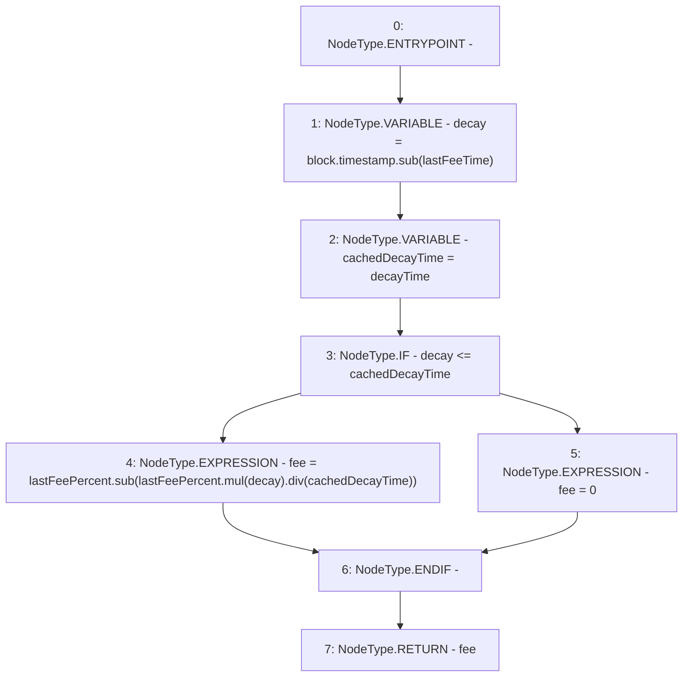

# Context: ThreePieceWiseLinearPriceCurve.calculateDecayedFee

**Contract:** `ThreePieceWiseLinearPriceCurve` (Inherits: Ownable, IPriceCurve)
**Signature:** `calculateDecayedFee() returns (uint256)`
**Method Selector ID:** `0xd26e6aa4`
**Visibility:** `public`
**Environment-Free:** `No (reads EVM state context)`
**Modifiers:** None

### State Variables Interaction
- **Reads:** decayTime, lastFeePercent, lastFeeTime
- **Writes:** None

### Environment & Verification Flags
- **Uses Foundry Cheatcodes:** No
- **Has Echidna Properties:** No

### Internal Calls Tree
- None

### External Calls / Value Transfers
- `SafeMath.TMP_112(uint256) = LIBRARY_CALL, dest:SafeMath, function:SafeMath.mul(uint256,uint256), arguments:['lastFeePercent', 'decay'] `
- `SafeMath.TMP_113(uint256) = LIBRARY_CALL, dest:SafeMath, function:SafeMath.div(uint256,uint256), arguments:['TMP_112', 'cachedDecayTime'] `
- `SafeMath.TMP_110(uint256) = LIBRARY_CALL, dest:SafeMath, function:SafeMath.sub(uint256,uint256), arguments:['block.timestamp', 'lastFeeTime'] `
- `SafeMath.TMP_114(uint256) = LIBRARY_CALL, dest:SafeMath, function:SafeMath.sub(uint256,uint256), arguments:['lastFeePercent', 'TMP_113'] `

### Control Flow Graph (CFG)


### Source Mapping
Declared in: `certora-ac-datasets/detasets/web3bugs/dataset/web3bugs/66/packages/contracts/contracts/PriceCurves/ThreePieceWiseLinearPriceCurve.sol` on lines **176** to **186**

```solidity
    function calculateDecayedFee() public override view returns (uint256 fee) {
        uint256 decay = block.timestamp.sub(lastFeeTime);
        // Decay within bounds of decay time, then decay the fee. 
        uint256 cachedDecayTime = decayTime;
        if (decay <= cachedDecayTime) {
            fee = lastFeePercent.sub(lastFeePercent.mul(decay).div(cachedDecayTime));
        } else {
            // If it has been longer than decay time, then reset fee to 0.
            fee = 0;
        }
    }

```
