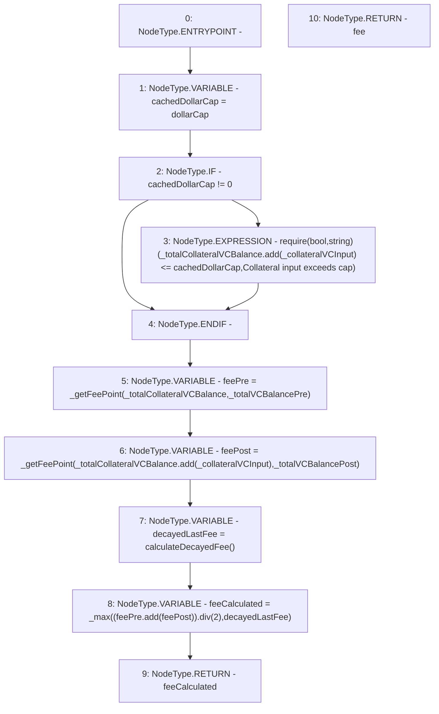

# Context: ThreePieceWiseLinearPriceCurve.getFee

**Contract:** `ThreePieceWiseLinearPriceCurve` (Inherits: Ownable, IPriceCurve)
**Signature:** `getFee(uint256,uint256,uint256,uint256) returns (uint256)`
**Method Selector ID:** `0x73ddaef4`
**Visibility:** `external`
**Environment-Free:** `No (reads EVM state context)`
**Modifiers:** None

### State Variables Interaction
- **Reads:** dollarCap
- **Writes:** None

### Assertion Checks & Business Requirements
- require/assert: `require(bool,string)(_totalCollateralVCBalance.add(_collateralVCInput) <= cachedDollarCap,Collateral input exceeds cap)`

### Environment & Verification Flags
- **Uses Foundry Cheatcodes:** No
- **Has Echidna Properties:** No

### Internal Calls Tree
- None

### External Calls / Value Transfers
- `SafeMath.TMP_60(uint256) = LIBRARY_CALL, dest:SafeMath, function:SafeMath.add(uint256,uint256), arguments:['_totalCollateralVCBalance', '_collateralVCInput'] `
- `SafeMath.TMP_68(uint256) = LIBRARY_CALL, dest:SafeMath, function:SafeMath.div(uint256,uint256), arguments:['TMP_67', '2'] `
- `SafeMath.TMP_64(uint256) = LIBRARY_CALL, dest:SafeMath, function:SafeMath.add(uint256,uint256), arguments:['_totalCollateralVCBalance', '_collateralVCInput'] `
- `SafeMath.TMP_67(uint256) = LIBRARY_CALL, dest:SafeMath, function:SafeMath.add(uint256,uint256), arguments:['feePre', 'feePost'] `

### Control Flow Graph (CFG)


### Source Mapping
Declared in: `certora-ac-datasets/detasets/web3bugs/dataset/web3bugs/66/packages/contracts/contracts/PriceCurves/ThreePieceWiseLinearPriceCurve.sol` on lines **110** to **124**

```solidity
    function getFee(uint256 _collateralVCInput, uint256 _totalCollateralVCBalance, uint256 _totalVCBalancePre, uint256 _totalVCBalancePost) override external view returns (uint256 fee) {
        // If dollarCap == 0, then it is not capped. Otherwise, then the total + the total input must be less than the cap.
        uint256 cachedDollarCap = dollarCap;
        if (cachedDollarCap != 0) {
            require(_totalCollateralVCBalance.add(_collateralVCInput) <= cachedDollarCap, "Collateral input exceeds cap");
        }

        uint feePre = _getFeePoint(_totalCollateralVCBalance, _totalVCBalancePre);
        uint feePost = _getFeePoint(_totalCollateralVCBalance.add(_collateralVCInput), _totalVCBalancePost);

        uint decayedLastFee = calculateDecayedFee();
        uint feeCalculated = _max((feePre.add(feePost)).div(2), decayedLastFee);

        return feeCalculated;
    }

```
