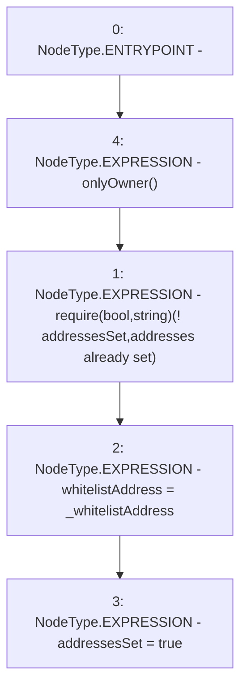

# Context: ThreePieceWiseLinearPriceCurve.setAddresses

**Contract:** `ThreePieceWiseLinearPriceCurve` (Inherits: Ownable, IPriceCurve)
**Signature:** `setAddresses(address)`
**Method Selector ID:** `0x81d3c435`
**Visibility:** `external`
**Environment-Free:** `No (reads EVM state context)`
**Modifiers:**
- `onlyOwner`
  ```solidity
  modifier onlyOwner() {
          require(isOwner(), "CallerNotOwner");
          _;
      }
  ```

### State Variables Interaction
- **Reads:** addressesSet
- **Writes:** addressesSet, whitelistAddress

### Assertion Checks & Business Requirements
- require/assert: `require(bool,string)(! addressesSet,addresses already set)`

### Environment & Verification Flags
- **Uses Foundry Cheatcodes:** No
- **Has Echidna Properties:** No

### Internal Calls Tree
- None

### External Calls / Value Transfers
- None

### Control Flow Graph (CFG)


### Source Mapping
Declared in: `certora-ac-datasets/detasets/web3bugs/dataset/web3bugs/66/packages/contracts/contracts/PriceCurves/ThreePieceWiseLinearPriceCurve.sol` on lines **79** to **83**

```solidity
    function setAddresses(address _whitelistAddress) external override onlyOwner {
        require(!addressesSet, "addresses already set");
        whitelistAddress = _whitelistAddress;
        addressesSet = true;
    }

```
