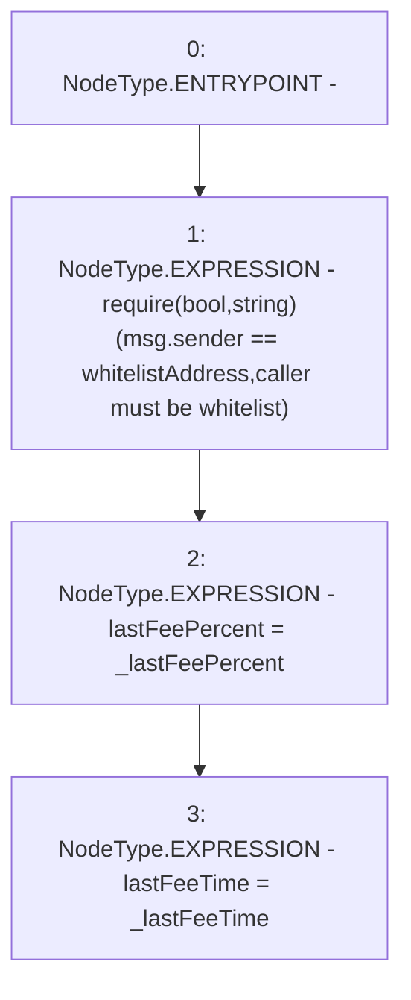

# Context: ThreePieceWiseLinearPriceCurve.setFeeCapAndTime

**Contract:** `ThreePieceWiseLinearPriceCurve` (Inherits: Ownable, IPriceCurve)
**Signature:** `setFeeCapAndTime(uint256,uint256)`
**Method Selector ID:** `0x2c3609a0`
**Visibility:** `external`
**Environment-Free:** `No (reads EVM state context)`
**Modifiers:** None

### State Variables Interaction
- **Reads:** whitelistAddress
- **Writes:** lastFeePercent, lastFeeTime

### Assertion Checks & Business Requirements
- require/assert: `require(bool,string)(msg.sender == whitelistAddress,caller must be whitelist)`

### Environment & Verification Flags
- **Uses Foundry Cheatcodes:** No
- **Has Echidna Properties:** No

### Internal Calls Tree
- None

### External Calls / Value Transfers
- None

### Control Flow Graph (CFG)


### Source Mapping
Declared in: `certora-ac-datasets/detasets/web3bugs/dataset/web3bugs/66/packages/contracts/contracts/PriceCurves/ThreePieceWiseLinearPriceCurve.sol` on lines **97** to **101**

```solidity
    function setFeeCapAndTime(uint256 _lastFeePercent, uint256 _lastFeeTime) external override {
        require(msg.sender == whitelistAddress, "caller must be whitelist");
        lastFeePercent = _lastFeePercent;
        lastFeeTime = _lastFeeTime;
    }

```
